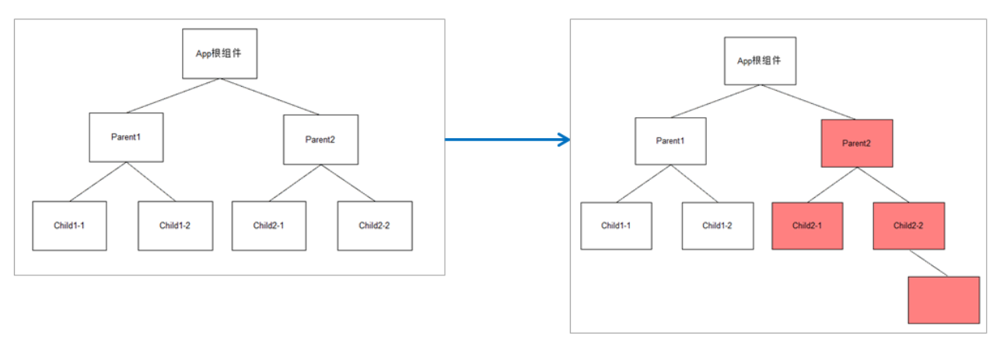
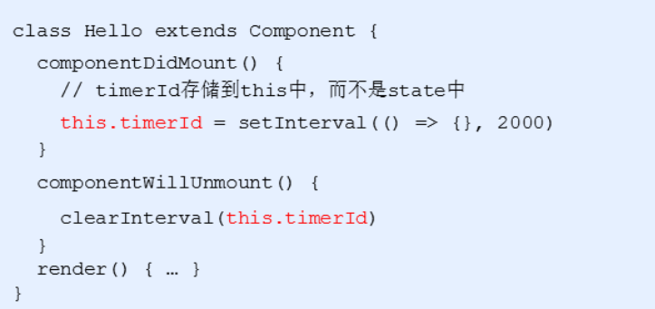
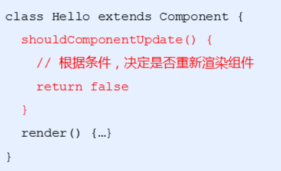
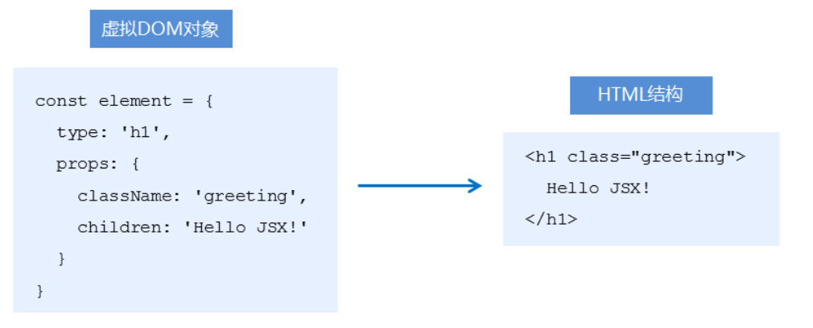
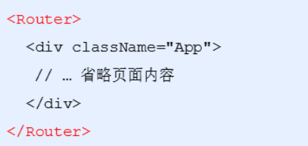
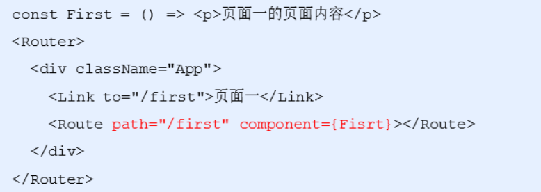
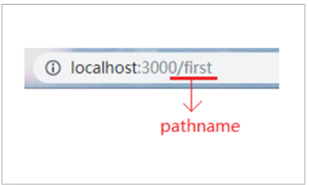
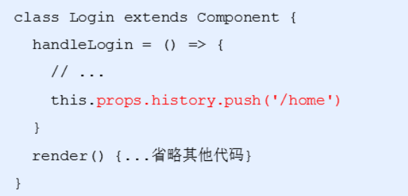
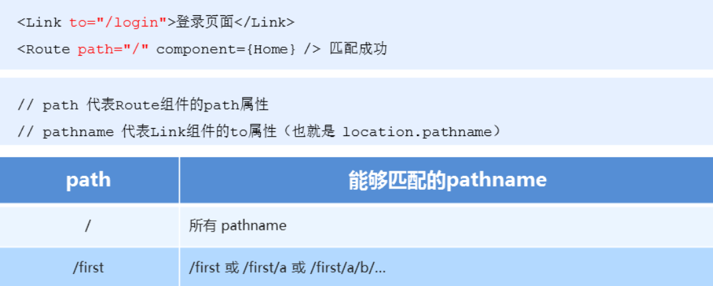

# React原理揭秘

## 目标

- 能够说出React组件的更新机制
- 能够对组件进行性能优化
- 能够说出虚拟DOM和DIff算法

## 组件更新机制

- setState() 的两个作用
  - 修改state
  - 更新组件

- 过程：父组件重新渲染时，也会重新渲染子组件，但只会渲染当前组件子树（当前组件以其所有子组件）



## 组件性能优化

### 减轻state

- 减轻state：只存储跟组件渲染相关的数据（比如：count/ 列表数据 /loading等）
- 注意：不用做渲染的数据不要放在state中
- 对于这种需要在多个方法中用到的数据，应该放到this中



### 避免不必要的重新渲染

- 组件更新机制：父组件更新会引起子组件也被更新，这种思路很清晰
- 问题：子组件没有任何变化时也会重新渲染
- 如果避免不必要的重新渲染？
- 解决方式：使用钩子函数 shouldComponentUpdate(nextProps, nextState)
  - 在这个函数中，nextProps和nextState是最新的状态以及属性
- 作用：这个函数有返回值，如果返回true，代表需要重新渲染，如果返回false，代表不需要重新渲染
- 触发时机：更新阶段的钩子函数，组件重新渲染前执行(shouldComponentUpdate => render)



#### 随机数案例

需求：随机生成数字，显示在页面，如果生成的数字与当前显示的数字相同，那么就不需要更新UI，反之更新UI。

利用nextState参数来判断当前组件是否需要更新

```react
class App extends React.Component {
    state = {
        number: 0
    }
    // 点击事件，每次点击生成一个随机数
    hanldeBtn = () => {
        this.setState({
            number: Math.floor(Math.random() * 3)
        })
    }
    // 将要更新UI的时候会执行这个钩子函数
    shouldComponentUpdate(nextProps,nextState) {
         // 判断一下当前生成的 值是否与页面的值相等
         if(nextState.number !== this.state.number){
             return true
         }
         return false
    }
    render() {
        return (
            <div>
                随机数：{this.state.number} <br />
                <button onClick={this.hanldeBtn}>生成随机数</button>
            </div>
        )
    }
}
```

利用props参数来判断是否需要进行更新

```react
class App extends React.Component {
    state = {
        number: 0
    }
    // 点击事件，每次点击生成一个随机数
    hanldeBtn = () => {
        this.setState({
            number: Math.floor(Math.random() * 3)
        })
    }

    render() {
        return (
            <div>
                <NumberBox number={this.state.number} />
                <button onClick={this.hanldeBtn}>生成随机数</button>
            </div>
        )
    }
}
class NumberBox extends React.Component {
    // 将要更新UI的时候会执行这个钩子函数
    shouldComponentUpdate(nextProps, nextState) {
        // 判断一下当前生成的 值是否与页面的值相等
        if (nextProps.number !== this.props.number) {
            return true
        }
        return false
    }
    render() {
        return (
            <h1>随机数：{this.props.number} </h1>
        )
    }
}
```

### 纯组件

#### 作用以及使用

- 纯组件： PureComponent 与 React.Component 功能相似
- 区别： PureComponent 内部自动实现了 shouldComponentUpdate钩子，不需要手动比较
- 原理：纯组件内部通过分别比对前后两次 props和state的值，来决定是否重新渲染组件


#### 实现原理

- 说明：纯组件内部的对比是 shallow compare（浅层对比）
- 对于值类型来说：比较两个值是否相同


- 引用类型：只比对对象的引用地址是否相同


- 注意：state 或 props 中属性值为引用类型时，应该创建新数据，不要直接修改原数据


## 虚拟DOM和Diff算法

- React更新视图的思想是：只要state变化就重新渲染视图
- 特点：思路非常清晰
- 问题：组件中只有一个DOM元素需要更新时，也得把整个组件的内容重新渲染吗？ 不是这样的
- 理想状态：部分更新，只更新变化的地方
- React运用的核心点就是 虚拟DOM 配合 Diff 算法

### 虚拟DOM

本质上就是一个JS对象，用来描述你希望在屏幕上看到的内容



### Diff算法

执行过程

- 初次渲染时，React会根据初始化的state（model），创建一个虚拟DOM对象（树）
- 根据虚拟DOM生成真正的DOM，渲染到页面
- 当数据变化后(setState())，会重新根据新的数据，创建新的虚拟DOM对象（树）
- 与上一次得到的虚拟DOM对象，使用Diff算法比对（找不同），得到需要更新的内容
- 最终，React只将变化的内容更新（patch）到DOM中，重新渲染到页面


### 代码演示

- 组件render()调用后，根据状态和JSX结构生成虚拟DOM对象(render()方法的调用并不意味着浏览器进行渲染，render方法调用时意味着Diff算法开始比对了)
- 示例中，只更新p元素的文本节点内容
- 初次渲染的DOM对象


- 数据更新之后的虚拟DOM对象


## 小结

- 工作角度：应用第一，原理第二
- 原理有助于更好的理解React的自身运行机制
- setState() 异步更新数据
- 父组件更新导致子组件更新，纯组件提升性能
- 思路清晰简单为前提，虚拟DOM和Diff保效率（渲染变化的组件）
- 虚拟DOM -> state + JSX
- 虚拟DOM最大的特点是 脱离了浏览器的束缚，也就是意味着只要是能支持js的地方都可以用到react，所以为什么说react是可以进行跨平台的开发

# React路由基础

## 目标

- 能够说出React路由的作用
- 能够掌握-react-router-dom的基本使用
- 能够使用编程式导航跳转路由
- 能够知道React路由的匹配模式

## React路由介绍

现代的前端应用大多数是SPA（单页应用程序），也就是只有一个HTML页面的应用程序。因为它的用户体验更好、对服务器压力更小，所以更受欢迎。为了有效的使用单个页面来管理多页面的功能，前端路由应运而生。

- 前端路由功能：让用户从一个视图（页面）导航到另一个视图（页面）
- 前端路由是一套映射规则，在React中，是URL路径与组件的对应关系
- 使用React路由简单来说，就是配置路径和组件

## 路由的基本使用

### 使用步骤

- 安装： yarn add react-router-dom
  
- 如果没有安装yarn工具的，需要先全局安装一下yarn：npm install -g yarn
  
- 导入路由的三个核心组件： Router / Route / Link

  ```react
  import {BrowserRouter as Router, Route, Link} from 'react-router-dom'
  ```

- 使用Router 组件包裹整个应用



- 使用Link组件作为导航菜单（路由入口）


- 使用Route组件配置路由规则和要展示的组件（路由出口）



### 常用组件说明

- **Router组件：**包裹整个应用，一个React应用只需要使用一次
  - 两种常用的Router： HashRouter和BrowserRouter
  - HashRouter： 使用URL的哈希值实现 （localhost:3000/#/first）
  - 推荐 BrowserRouter：使用H5的history API实现（localhost3000/first）
- **Link组件：**用于指定导航链接（a标签）
  - 最终Link会编译成a标签，而to属性会被编译成 a标签的href属性
- **Route组件：**指定路由展示组件相关信息
  - path属性：路由规则，这里需要跟Link组件里面to属性的值一致
  - component属性：展示的组件
  - Route写在哪，渲染出来的组件就在哪

### 路由的执行过程

- 当我们点击Link组件的时候，修改了浏览器地址栏中的url
- React路由监听地址栏url的变化
- React路由内部遍历所有的Route组件，拿着Route里面path规则与pathname进行匹配



- 当路由规则（path）能够匹配地址栏中的pathname时，就展示该Route组件的内容

### 编程式导航

- **场景：**点击登陆按钮，登陆成功后，通过代码跳转到后台首页，如何实现？
- **编程式导航：**通过JS代码来实现页面跳转
- history是React路由提供的，用于获取浏览器历史记录的相关信息
- **push(path)：**跳转到某个页面，参数path表示要跳转的路径
- go(n)：前进或后退功能，参数n表示前进或后退页面数量



### 默认路由

- 现在的路由都是通过点击导航菜单后展示的，如果进入页面的时候就主动触发路由呢
- 默认路由：表示进入页面时就会匹配的路由
- 默认路由：只需要把path设置为 `'/'`


### 匹配模式

#### 模糊匹配模式

- 当Link组件的to属性值为 '/login' 时候，为什么默认路由也被匹配成功？
- 默认情况下，React路由是模糊匹配模式
- 模糊匹配规则：只要pathname以path开头就会匹配成功



#### 精准匹配

- 默认路由认可情况下都会展示，如果避免这种问题？
- 给Route组件添加exact属性，让其变为**精准匹配模式**
- 精确匹配：只有当path和pathname完全匹配时才会展示改路由


### 小结

- React路由可以有效的管理多个视图实现 SPA
- 路由先需要通过安装
- Router组件包裹整个应用，只需要使用一次
- Link组件是入口，Route组件是出口
- 通过props.history实现编程式导航
- 默认是模糊匹配，添加exact编程精确匹配
- React路由的一切都是组件，可以像思考组件一样思考路由