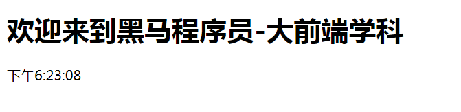
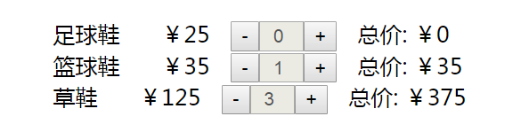

# 时钟案例



## 实现思路

- 利用类组件的方式创建 Clock类
- 在Clock类里面实现render方法，在render方法的return 返回要显示的数据
- 由于页面一加载的时候就开始自动计时，所以我们需要监听到组件的生命周期
  - `componentDidMount()`  当组件渲染完毕后调用，在这个里面可以开启定时器
  - `componentWillUnmount()`   当组件被移除时候调用，在这里可以移除定时器
- 在开启的定时器里面，我们利用 `setState()` 方法，来获取到当前最新的系统时间
- 在JSX的结构中，我们通过this.state 来获取到最新的时间，只要调用了`setState()` 方法修改了值，就会导致render方法调用，这样最新的内容就在页面中显示了

## 示例代码

```react
class Clock extends React.Component {
    constructor(props){
        super(props);
        this.state = {date: new Date()}
    }
    //当组件渲染完毕后调用
    componentDidMount(){
        //在这个里面就可以开启定时器来执行定时任务
        this.id = setInterval(()=>{
               this.setState({
                   date: new Date()
               });
        },1000);
    }
    //当组件被移除的时候调用
    componentWillUnmount(){
         clearInterval(this.id);
    }
    render(){
        return (
            <div>
                <h1>欢迎来到黑马程序员-大前端学科</h1>
                <div>{this.state.date.toLocaleTimeString()}</div>
            </div>
        )
    }
};
ReactDOM.render( <Clock /> , document.getElementById('root'))
```

# 简单购物车单价计算案例



## 实现思路

- 利用类组件的方式创建 Cart类
- 在Cart类里面实现render方法，在render方法的return 返回要显示的数据
- 修改一下样式属性

```css
ul {
    list-style: none;
}

span {
    margin: 0 15px;
}

input {
    width: 20px;
    padding-left: 8px;
}
```

- 定义好数据集合

```react
state = {
    carts: [{
        id: 1,
        name: '足球鞋',
        price: 25,
        count: 1,
        total: 25
    }, {
        id: 2,
        name: '篮球鞋',
        price: 35,
        count: 1,
        total: 35
    }, {
        id: 3,
        name: '草鞋',
        price: 125,
        count: 1,
        total: 125
    }]
}
```

- 在render方法里面利用JSX的列表渲染把数组里面的数据设置到标签上

```react
<li key={item.id}>
    {/* 显示的名称 */}
    <span>{item.name}</span>
    {/* 显示的价格 */}
    <span>￥{item.price}</span>
    {/* -按钮 */}
    <button onClick={this.reduce} data-id={item.id}>-</button>
    {/* 显示数量 */}
    <input type="text" value={item.count} disabled />
    {/* +按钮 */}
    <button onClick={this.add} data-id={item.id}>+</button>
    {/* 总价 */}
    <span>总价: ￥{item.total}</span>
</li>
```

- 给 -按钮 和+按钮绑定事件，这里需要注意，我们点击每一个按钮需要拿到对应的id，所以我们在button标签中绑定当前商品对象的id，方便在点击事件里面获取（注意this指向的问题）
- 在点击事件处理函数中获取到当前的id，遍历数组，判断id是否相同，如果相同，更改一下数量，然后计算一下总价
- 最后通过`this.setState()` 方法来进行更新页面

## 示例代码

```react
class Cart extends React.Component {
    constructor() {
        super()
        // 给方法绑定this
        this.reduce = this.reduce.bind(this);
        this.add = this.add.bind(this);
    }
    state = {
        carts: [{
            id: 1,
            name: '足球鞋',
            price: 25,
            count: 1,
            total: 25
        }, {
            id: 2,
            name: '篮球鞋',
            price: 35,
            count: 1,
            total: 35
        }, {
            id: 3,
            name: '草鞋',
            price: 125,
            count: 1,
            total: 125
        }]
    }
    // 点击-按钮的事件
    reduce(e) {
        // 拿到当前标签上绑定的对应的id，通过id找到对应的对象，然后通过setState来更新数据
        this.state.carts.map(item => {
            // 如果id相同，我们就需要把数量进行-1
            if (item.id == e.target.dataset.id) {
                if (item.count > 0)
                    item.count--
                // 计算一下总价，在遍历this.state.carts的时候，数据其实已经进行了更改，我们只需要通知React调用一下render来进行重新渲染即可
                item.total = item.count * item.price
            }
        })
        // 调用setState方法来让render方法进行重新执行
        this.setState({});
    }
    // 点击+按钮的事件
    add(e) {
        // 拿到当前标签上绑定的对应的id，通过id找到对应的对象，然后通过setState来更新数据
        this.state.carts.map(item => {
            // 如果id相同，我们就需要把数量进行+1
            if (item.id == e.target.dataset.id) {
                item.count++
                // 计算一下总价，在遍历this.state.carts的时候，数据其实已经进行了更改，我们只需要通知React调用一下render来进行重新渲染即可
                item.total = item.count * item.price
            }
        })
        // 调用setState方法来让render方法进行重新执行
        this.setState({});
    }
    render() {
        return (
            <ul>
                {this.state.carts.map(item => {
                    return (
                        <li key={item.id}>
                            {/* 显示的名称 */}
                            <span>{item.name}</span>
                            {/* 显示的价格 */}
                            <span>￥{item.price}</span>
                            {/* -按钮 */}
                            <button onClick={this.reduce} data-id={item.id}>-</button>
                            {/* 显示数量 */}
                            <input type="text" value={item.count} disabled />
                            {/* +按钮 */}
                            <button onClick={this.add} data-id={item.id}>+</button>
                            {/* 总价 */}
                            <span>总价: ￥{item.total}</span>
                        </li>
                    )
                })}
            </ul>
        )
    }
}
ReactDOM.render(<Cart />, document.getElementById('root'))
```

