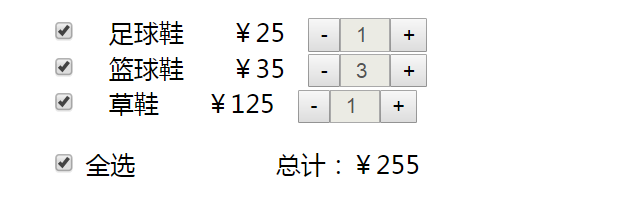
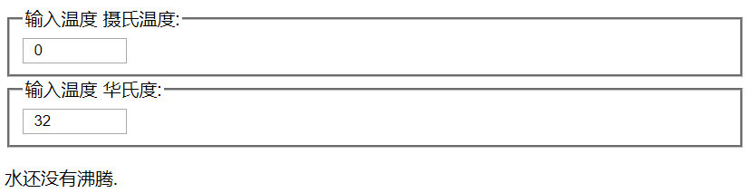

# 购物车全选和总价实现



**需求：** 简单的购物车的全选和总计的功能实现，这里用到了状态提升，涉及到父传子、子传父，兄弟之间的数据的传递

### 页面基本结构

- 布局相应的结构，每一个li里面要设置的内容比较多，所以我们把li单独抽取成一个组件

```react
class Cart extends React.Component {
    state = {
        carts: [{
            id: 1,
            name: '足球鞋',
            price: 25,
            count: 1,
            isChecked: false
        }, {
            id: 2,
            name: '篮球鞋',
            price: 35,
            count: 1,
            isChecked: false
        }, {
            id: 3,
            name: '草鞋',
            price: 125,
            count: 1,
            isChecked: false
        }],
        // 总价
        total: 0,
        // 全选状态
        allCheckStatus: false
    }
    render() {
        return (
            <div>
                <ul>
                    {this.state.carts.map(item => {
                        return (
                            <ProList key={item.id} item={item}/>
                        )
                    })}
                </ul>
                <div className="allCheck">
                    {/* 需要根据我们定义的属性来判断是否是全选 */}
                    <input type="checkbox" />全选
                    <span className="total">总计：￥{this.state.total}</span>
                </div>
            </div>
        )
    }
}
class ProList extends React.Component {
    render() {
        return (
            <li key={this.props.item.id}>
                {/* 是否勾选 */}
                <input type="checkbox" checked={this.props.item.isChecked ? 'checked' : ''} />
                {/* 显示的名称 */}
                <span>{this.props.item.name}</span>
                {/* 显示的价格 */}
                <span>￥{this.props.item.price}</span>
                {/* -按钮 */}
                <button onClick={this.childReduce}>-</button>
                {/* 显示数量 */}
                <input type="text" value={this.props.item.count} disabled />
                {/* +按钮 */}
                <button onClick={this.childAdd}>+</button>
            </li>
        )
    }
}
ReactDOM.render(<Cart />, document.getElementById('root'))
```

- 对应的css代码

```css
ul {
    list-style: none;
}

span {
    margin: 0 15px;
}

input {
    width: 20px;
    padding-left: 8px;
}

.allCheck {
    padding-left: 40px;
}

.total {
    margin-left: 90px;
}
```

### 加减按钮的点击事件处理

- 结构写完后，现在页面上可以看到对应的效果，但是点击按钮的逻辑没有实现，此时需要给  + - 按钮添加点击事件
- 利用子传父的方式，我们需要在父组件中定义两个回调函数，分别对应 +(add) 和 -(reduce)
- 然后把这两个回调函数设置到子组件的属性上，通过props传递到子组件
- 给子组件添加点击事件`(childAdd、childReduce)`，当点击了后，调用 通过props传递过来的函数
- 调用这个函数的时候需要传递一个数据，就是商品的id，这样在父组件的方法中才能知道用户点击的是哪一个商品
- 拿到传递过来的id后，需要遍历 carts的数组，判断是否与传递过来的id相同，如果相同，修改相应的数量，然后通过`this.setState()` 来更新UI

### 子组件的checkbox状态更改

- 需要把checkbox做成受控组件，受控的值是有父组件传递过来的商品对象里面的`isCheck`的值，所以我们需要给checkbox绑定 `onChange`事件
- 在`onChange`事件里面，需要调用父组件的函数，来修改对应的`isCheck`的值，这里就需要父组件定义一个回调函数(`onCheckStatus`)，通过props传递给子组件
- 调用父组件对应回调函数的时候需要携带两个参数，一个是当前选中的状态，一个是对应商品的id
- 在父组件的回调函数里面获取到两个值之后，需要遍历当前carts，判断id是否相同，如果相同，修改对应的状态
- 还需要完成一件事，判断一下当前所有的商品的`isCheck`的值是否为true，如果是true，需要更改一下全选的状态
- 调用一下 `this.setState()` 来更新UI

### 全选按钮的状态更改

- 给全选按钮设置一个状态(`allCheckStatus`)，绑定 `onChange`事件
- 在事件处理逻辑中，把当前状态赋值给state里面的状态
- 同步更新子组件里面的状态，遍历carts，把所有商品对象的`isCheck`状态设置与`allCheckStatus`的一致
- 然后利用 `this.setState()` 来更新UI

### 总价更新

- 在父组件的 state里面定义 状态(total)
- 在每一次更新UI的时候(+按钮、-按钮、单选、全选)，都需要遍历一下carts，判断商品对象的`isCheck`的属性是否是true，如果是true代表选中，累加到total上即可

### 示例代码

```react
class Cart extends React.Component {
    constructor() {
        super()
        // 给方法绑定this
        this.reduce = this.reduce.bind(this);
        this.add = this.add.bind(this);
        this.onCheckStatus = this.onCheckStatus.bind(this)
        this.computeTotal = this.computeTotal.bind(this)
        this.onAllCheckStatus = this.onAllCheckStatus.bind(this)
    }
    state = {
        carts: [{
            id: 1,
            name: '足球鞋',
            price: 25,
            count: 1,
            isChecked: false
        }, {
            id: 2,
            name: '篮球鞋',
            price: 35,
            count: 1,
            isChecked: false
        }, {
            id: 3,
            name: '草鞋',
            price: 125,
            count: 1,
            isChecked: false
        }],
        // 总价
        total: 0,
        // 全选状态
        allCheckStatus: false
    }
    // 父组件提供给子组件调用的-按钮的函数
    reduce(id) {
        // 只要子组件一旦点击了按钮，就会触发父组件的函数,这里遍历carts，匹配到对应的id，然后修改数量
        this.state.carts.map(item => {
            if (item.id == id) {
                if (item.count > 0)
                    item.count--
            }
        })
        // 计算一下总价钱
        this.computeTotal()
        this.setState({})
    }
    // 父组件提供给子组件调用的+按钮的函数
    add(id) {
        // 只要子组件一旦点击了按钮，就会触发父组件的函数,这里遍历carts，匹配到对应的id，然后修改数量
        this.state.carts.map(item => {
            if (item.id == id) {
                item.count++
            }
        })
        // 计算一下总价钱
        this.computeTotal()
        this.setState({})
    }
    /**
     * 计算总价
     */
    computeTotal() {
        // 先清空总价
        this.state.total = 0
        // 遍历数组，看看里面是否是选中状态，如果是，需要计算一下总价
        this.state.carts.map(item => {
            if (item.isChecked) {
                this.state.total += item.count * item.price
            }
        })
    }
    // 提供给子组件调用的函数，当子组件的checkbox状态发生改变的时候调用
    onCheckStatus(status, id) {
        // 假设是全选的状态
        let flag = true;
        this.state.carts.map(item => {
            // 如果当前id等于传递过来的id，那么需要修改状态
            if (item.id == id)
                item.isChecked = status
            // 判断一下是否是全选
            if (!item.isChecked) {
                flag = false
            }
        })
        // 把最后flag的值赋值给state里面的属性
        this.state.allCheckStatus = flag
        // 计算一下总价钱
        this.computeTotal()
        this.setState({})
    }
    // 全选按钮的状态,需要把子组件里面的状态与之对应
    onAllCheckStatus(e) {
        // 把我们定义的allCheckStatus的状态对应
        this.state.allCheckStatus = e.target.checked
        this.state.carts.map(item => {
            item.isChecked = e.target.checked
        })
        // 计算一下总价钱
        this.computeTotal()
        this.setState({})
    }
    render() {
        return (
            <div>
                <ul>
                    {this.state.carts.map(item => {
                        return (
                            <ProList key={item.id} item={item} add={this.add} reduce={this.reduce} onCheckStatus={this.onCheckStatus} />
                        )
                    })}
                </ul>
                <div className="allCheck">
                    {/* 需要根据我们定义的属性来判断是否是全选 */}
                    <input type="checkbox" checked={this.state.allCheckStatus ? 'checked' : ''} onChange={this.onAllCheckStatus} />全选
                    <span className="total">总计：￥{this.state.total}</span>
                </div>
            </div>
        )
    }
}
class ProList extends React.Component {
    // 子组件里面的点击事件，点击后触发父组件的函数
    childReduce = (e) => {
        this.props.reduce(e.target.dataset.id)
    }
    // 子组件里面的点击事件，点击后触发父组件的函数
    childAdd = (e) => {
        this.props.add(e.target.dataset.id)
    }
    // checkbox勾选框状态改变的时候，需要把值传递到父组件中，然后修改对应的选中状态，进行刷新
    handleChange = (e) => {
        // 将状态以及当前商品的id传递给父组件
        this.props.onCheckStatus(e.target.checked, e.target.dataset.id)
    }
    render() {
        return (
            <li key={this.props.item.id}>
                {/* 是否勾选 */}
                <input type="checkbox" checked={this.props.item.isChecked ? 'checked' : ''} onChange={this.handleChange} data-id={this.props.item.id} />
                {/* 显示的名称 */}
                <span>{this.props.item.name}</span>
                {/* 显示的价格 */}
                <span>￥{this.props.item.price}</span>
                {/* -按钮 */}
                <button onClick={this.childReduce} data-id={this.props.item.id}>-</button>
                {/* 显示数量 */}
                <input type="text" value={this.props.item.count} disabled />
                {/* +按钮 */}
                <button onClick={this.childAdd} data-id={this.props.item.id}>+</button>
            </li>
        )
    }
}
ReactDOM.render(<Cart />, document.getElementById('root'))
```

# 温度计



**需求：**当用户输入 摄氏温度，我们需要把值转成华氏度，如果摄氏温度没有达到100，下面显示水还没有沸腾，否则显示沸腾了，这里用到了状态提升，涉及到父传子、子传父，兄弟之间的数据的传递

### 页面的基本结构

```react
const scaleNames = {
  c: 'Celsius',//摄氏温度
  f: 'Fahrenheit'//华氏度
};
/**
  温度输入框的自定义组件
*/
class TemperatureInput extends React.Component {
    render() {
      return (
        <fieldset>
          <legend>输入温度: {scaleNames[scale]=='Celsius' ? '摄氏温度':'华氏度' }:</legend>
          <input value={temperature}
                />
        </fieldset>
      );
    }
  }
class Calculator extends React.Component {
  render() {
      return (
      <div>
        <TemperatureInput scale="c" />
        <TemperatureInput scale="f" />
        <BoilingVerdict
        celsius={parseFloat(celsius)} />
      </div>
    );
  }
}
function BoilingVerdict(props) {
  if (props.celsius >= 100) {
    return <p>水沸腾了.</p>;
  }
  return <p>水还没有沸腾.</p>;
}
ReactDOM.render(<Calculator />,document.getElementById('root'));
```

### 摄氏度和华氏度转换工具

```react
//转摄氏温度
function toCelsius(fahrenheit) {
    return (fahrenheit - 32) * 5 / 9;
}
// 转华氏度
function toFahrenheit(celsius) {
    return (celsius * 9 / 5) + 32;
}
```

### 温度的相互转换

- 摄氏度和华氏度两个子组件是兄弟关系，数据要通过父组件来进行共享，所以需要在父组件上定义一个温度的状态(`temperature`)，以及温度类型的状态(`scale`)
- 父组件还需要提供回调函数，当子组件触发了，两个触发点，需要定义两个回调函数，摄氏度(`handleCelsiusChange`)、华氏度(`handleFahrenheitChange`)
- 把这两个函数当前子组件的属性，属性名相同，属性值不同，这样子组件只需要调用相应的属性名即可，通过props传递到子组件中
- 在子组件的输入框绑定 `onChange` 事件，在事件处理逻辑里面调用 传递过来的回调函数，把当前输入的值传递给父组件
- 父组件拿到相应的值后，通过`this.setState()` 方法更新里面的数据
- 一旦调用了`this.setState()` 方法，就会导致render方法重新执行，在这里我们需要对温度的值进行换算
- 通过state状态里面的`scale`来判断是华氏度还是摄氏度，相应调用一下转换工具函数，把结果设置到对应的子组件的函数属性中

### 示例代码

```react
//转摄氏温度
function toCelsius(fahrenheit) {
    return (fahrenheit - 32) * 5 / 9;
}
// 转华氏度
function toFahrenheit(celsius) {
    return (celsius * 9 / 5) + 32;
}
  
function tryConvert(temperature, convert) {
    const input = parseFloat(temperature);
    if (Number.isNaN(input)) {
      return '';
    }
    const output = convert(input);
    const rounded = Math.round(output * 1000) / 1000;
    return rounded.toString();
}
function BoilingVerdict(props) {
    if (props.celsius >= 100) {
      return <p>水沸腾了.</p>;
    }
    return <p>水还没有沸腾.</p>;
  }
  const scaleNames = {
    c: 'Celsius',//摄氏温度
    f: 'Fahrenheit'//华氏度
  };
/**
  温度输入框的自定义组件
*/
class TemperatureInput extends React.Component {
    constructor(props) {
      super(props);
      this.handleChange = this.handleChange.bind(this);
    }
    //绑定一个方法，当用户输入的时候触发
    handleChange(e) {
     //由于两个子控件数据互不干扰，所以我们需要通过父组件来进行数据分享
     this.props.onTemperatureChange(e.target.value);
    }
  
    render() {
      // 接收父组件传递过来的值
      const temperature = this.props.temperature;
      const scale = this.props.scale;
      return (
        <fieldset>
          <legend>输入温度 {scaleNames[scale]=='Celsius' ? '摄氏温度':'华氏度' }:</legend>
          <input value={temperature}
                 onChange={this.handleChange} />
        </fieldset>
      );
    }
  }
class Calculator extends React.Component {
  constructor(props) {
      super(props);
      // 绑定函数的this指向
      this.handleCelsiusChange = this.handleCelsiusChange.bind(this);
      this.handleFahrenheitChange = this.handleFahrenheitChange.bind(this);
      this.state = {temperature: '', scale: 'c'};
  }
  // 给父组件设置 onTemperatureChange 属性，方便子组件来进行调用，一旦调用，会触发自己相应的方法，在方法里面利用setState来让父组件进行更新，把最新的值传递到子组件里
  handleCelsiusChange(temperature) {
      this.setState({scale: 'c',temperature: temperature});
  }
  handleFahrenheitChange(temperature) {
      this.setState({scale: 'f',temperature: temperature});
  }
  render() {
      // 把对应的值取出来,方便设置,这样结构中代码简洁一些
      const scale = this.state.scale;
      const temperature = this.state.temperature;
      const celsius = scale === 'f' ? tryConvert(temperature, toCelsius) : temperature;
      const fahrenheit = scale === 'c' ? tryConvert(temperature, toFahrenheit) : temperature;
      return (
      <div>
        <TemperatureInput scale="c" temperature={celsius} onTemperatureChange={this.handleCelsiusChange} />
        <TemperatureInput scale="f" temperature={fahrenheit} onTemperatureChange={this.handleFahrenheitChange} />
        <BoilingVerdict
        celsius={parseFloat(celsius)} />
      </div>
    );
  }
}
ReactDOM.render(<Calculator />,document.getElementById('root'));
```

