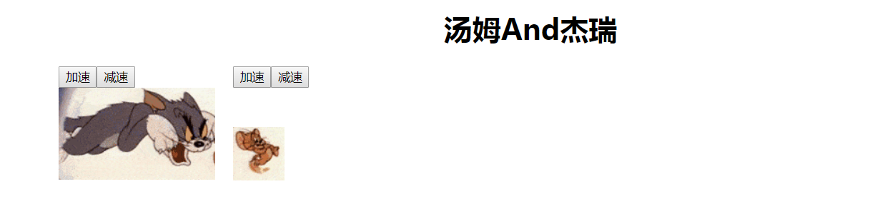

# 高阶函数作业



需求： Tom 和Jerry两个组件都包含了水平移动的公共属性和 加速、减速的公共方法，我们利用高阶组件，把公共的属性和方法就行封装

- 创建函数(`withMove`)，封装相同属性和方法
- 在函数里面创建类组件 `Move`，在Move里面定义公共属性: `speedX`，提供两个公共的方法：`speedUp`和`speedDown`
- 在`speedUp`函数处理程序中，没点击一次，增加一次步进，然后把步进设置到 `speedX`里面，`speedDown`逻辑处理相反，因为需要一直不停的移动，所以需要在里面开启定时器
- 然后把 `speedUp` 和`speedDown` 通过组件的属性返回到需要封装的组件里面
- 定义两个类组件 `Tom` 和 `Jerry`，在这两个类组件的render方法里面定义两个按钮，和一个`img`，在按钮里面通过 this.props.函数名，获取到对应要处理的函数名称
- 调用withMove，把两个需要加强的类组件传递进去，获取到封装好的类组件
- 最后设置给父组件，渲染到UI

**提供包装组件的函数**

```react
/**
 * 包装组件的函数
 * @param {*} WrappedComponent 需要包装的组件对象
 * @returns 封装了公共状态和方法的类组件
 */
function withMove(WrappedComponent) {
    // 创建一个类组件，提供公共的状态和方法
    class Move extends React.Component {
        // 公共的状态
        state = {
            speedX: 0,
            // 定时器id
            timeId: null,
            // 步进
            step: 5
        }
        constructor() {
            super()
            // 给函数绑定this
            this.speedUp = this.speedUp.bind(this)
            this.speedDown = this.speedDown.bind(this)
        }
        // 当页面加载的时候,获取元素不同的位置,设置给state
        componentDidMount() {
            // 两个组件初始化的位置不同，通过组件的自定义属性来获取
            this.setState({
                speedX: parseInt(document.getElementById(WrappedComponent.name + 'Div').dataset.left)
            })

        }
        // 公共的方法
        // 点击加速按钮，让元素加速移动
        speedUp() {
            console.log('触发了', window.innerWidth);
            this.state.step += 5
            // 移除定时器
            clearInterval(this.state.timeId)
            // 开启定时器
            this.state.timeId = setInterval(() => {
                if (this.state.speedX >= window.innerWidth) {
                    alert('到达终点了')
                    clearInterval(this.state.timeId)
                    return
                }
                this.setState({
                    state: this.state.speedX += this.state.step
                })
            }, 500)
        }
        // 点击减速按钮，让元素减速移动
        speedDown() {
            // 移除定时器
            clearInterval(this.state.timeId)
            // 点击一次前进的步进减少5个像素
            this.state.step -= 5
            if (this.state.step < 5) {
                // 最低的步进就是5个像素
                this.state.step = 5
            }
            // 开启定时器
            this.state.timeId = setInterval(() => {
                if (this.state.speedX >= window.innerWidth) {
                    alert('到达终点了')
                    clearInterval(this.state.timeId)
                    return
                }
                this.setState({
                    state: this.state.speedX += this.state.step
                })
            }, 500)
        }
        // 当组件移除的时候注销事件
        componentWillUnmount() {
            clearInterval(this.state.timeId)
        }
        render() {
            return (
                <div>
                    {/* 传递过去状态，还需要传递过去点击事件触发的函数 */}
                    <WrappedComponent {...this.state} {...this.props} speedUp={this.speedUp} speedDown={this.speedDown} />
                </div>
            )
        }
    }
    // 设置别名
    Move.displayName = `WithMouse${getDisplayName(WrappedComponent)}`
    return Move
}
/**
 * 提供获取别名的方法
 * @param {*} WrappedComponent 
 */
function getDisplayName(WrappedComponent) {
    return WrappedComponent.displayName || WrappedComponent.name || 'Component'
}
```

**两个类组件**

```react
/**
 * Tom的组件
 */
class Tom extends React.Component {
    render() {
        return (
            <div id="TomDiv" data-left='0' style={
                {
                    'position': 'absolute',
                    'left': this.props.speedX + 'px',
                    "width":'175px'
                }
            }>
                <div  >
                    <button onClick={this.props.speedUp}>加速</button>
                    <button onClick={this.props.speedDown}>减速</button>
                </div>
                
            </div>
        )
    }
}
/**
 * Jerry的组件
 */
class Jerry extends React.Component {
    render() {
        return (
            <div id="JerryDiv" data-left='175' style={
                {
                    'position': 'absolute',
                    'left': this.props.speedX + 'px'
                }
            }>
                <div  >
                    <button onClick={this.props.speedUp}>加速</button>
                    <button onClick={this.props.speedDown}>减速</button>
                </div>
                
            </div>
        )
    }
}
```

最后调用函数加强一下，挂载到页面

```react
// 包装一下Tom组件
const TomMove = withMove(Tom)
// 包装一下Jerry组件
const JerryMove = withMove(Jerry)
class App extends React.Component {
    render() {
        return (
            <div>
                <h1 style={{ 'textAlign': 'center' }}>汤姆And杰瑞</h1>
                <TomMove />
                <JerryMove />
            </div>
        )
    }
}
ReactDOM.render(<App />, document.getElementById('root'));
```

