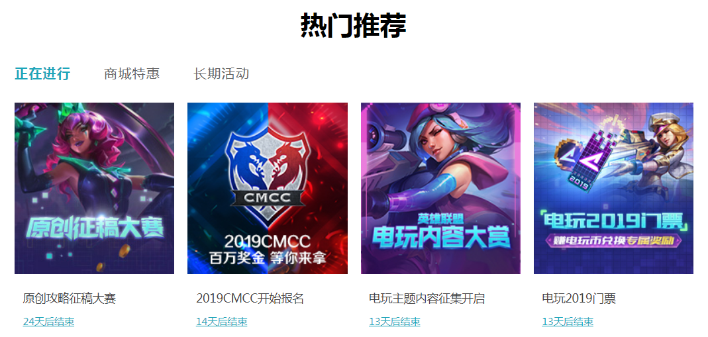

# 仿英雄联盟热门活动模块



## 实现思路

- 三个不同的tab栏，对应创建三个不同的js文件，通过Router来进行匹配

- 创建对应的包结构

  ```
  目录结构：
  		| - index.js
  		| - index.css
  			| - nav 
  				| - js
  				    | - loading.js
  				    | - tehui.js
  				    | - huodong.js
  		| - assets
  			| - images
  			    | - loading-01.jpg
  			    ...
  ```

- 安装 `react-router-dom`

- 在index.js 里面引入 Router、Route、`NavLink`（这里我们使用`NavLink`，与Link使用是一致的，多了一个选中高亮的效果）

- 在index.js 里面定义类组件的render方法里面 用Router组件包裹我们内容，通过`NavLink`组件来指定跳转的pathname，对应通过Route来指定对应path需要渲染的组件

- 在 loading.js tehui.js huodong.js 三个js里面创建对应的组件，通过 export进行导出，里面定义好相应的数据结构

  - loading中的，其他两个js中是同理

    ```react
    import imgUrl1 from '../../assets/images/loading-01.jpg'
    import imgUrl2 from '../../assets/images/loading-02.jpg'
    import imgUrl3 from '../../assets/images/loading-03.jpg'
    import imgUrl4 from '../../assets/images/loading-04.jpg'
    state = {
            loadingData: [{
                id: 0,
                pic: imgUrl1,
                title: '原创攻略征稿大赛',
                overTime: '24天后结束'
            }, {
                id: 1,
                pic: imgUrl2,
                title: '2019CMCC开始报名',
                overTime: '14天后结束'
            }, {
                id: 2,
                pic: imgUrl3,
                title: '电玩主题内容征集开启',
                overTime: '13天后结束'
            }, {
                id: 3,
                pic: imgUrl4,
                title: '电玩2019门票',
                overTime: '13天后结束'
            }]
        }
    ```

  - tehui中

    ```react
    state = {
        tehuiData: [{
            id: 0,
            pic: imgUrl1,
            title: '泳池派对周边',
            overTime: '24天后结束'
        }, {
            id: 1,
            pic: imgUrl2,
            title: '每周限时优惠',
            overTime: '已结束'
        }, {
            id: 2,
            pic: imgUrl3,
            title: '每周限时优惠',
            overTime: '已结束'
        }, {
            id: 3,
            pic: imgUrl4,
            title: 'LPL耐克联名T恤',
            overTime: '1天后结束'
        }]
    }
    ```

  - huodong中

    ```react
    state = {
        huodongData: [{
            id: 0,
            pic: imgUrl1,
            title: '终极连击，电玩一夏',
            overTime: '长期活动'
        }, {
            id: 1,
            pic: imgUrl2,
            title: '福来Day',
            overTime: '长期活动'
        }, {
            id: 2,
            pic: imgUrl3,
            title: '《校园解说大赛》等你发声！',
            overTime: '长期活动'
        }, {
            id: 3,
            pic: imgUrl4,
            title: '高校自发赛',
            overTime: '1天后结束'
        }]
    }
    ```

- 在各自组件的render方法里面，通过map()遍历state里面的数据，然后给相应标签设置相应的值

- CSS的样式

  ```css
  /* 内容里面条目的样式*/
  .act-item {
      list-style: none;
      float: left;
      width: 193px;
      height: 278px;
      margin: 0 16px 20px 0;
      overflow: hidden;
      position: relative;
  }
  /* 条目里面图片的样式*/
  .act-item img {
      display: block;
      width: 193px;
      height: 207px;
  }
  /* 条目里面对应标题的样式*/
  .act-item>p {
      width: 100%;
      overflow: hidden;
      box-sizing: border-box;
      padding: 6px 10px 4px 10px;
      font-size: 14px;
      color: #424242;
      line-height: 18px;
      text-align: left;
  }
  /* 条目里面最下面a标签的样式*/
  .overtime {
      position: absolute;
      font-size: 12px;
      color: #1da6ba;
      left: 10px;
      bottom: 6px;
  }
  /* 导航栏的样式*/
  .nav {
      position: relative;
      cursor: pointer;
      float: left;
      width: auto;
      min-width: 40px;
      height: 37px;
      overflow: visible;
      color: #676767;
      font-size: 16px;
      letter-spacing: 1px;
      line-height: 35px;
      text-align: center;
      text-decoration: none;
      margin-right: 40px;
  }
  /* 导航栏选中的样式*/
  .nav-active {
      font-weight: 700;
      color: #1da6ba;
  }
  ```

  

## 示例代码

- index.js中代码

```react
import React from 'react';
import ReactDOM from 'react-dom';
import './index.css'
import { BrowserRouter as Router, Route, Link, NavLink } from 'react-router-dom'
import Loading from './nav/js/loading'
import TeHui from './nav/js/tehui'
import HuoDong from './nav/js/huodong'

class App extends React.Component {

    render() {
        return (
            <Router>
                <h1 style={{ 'textAlign': 'center' }}>热门推荐</h1>
                {/* 导航栏区域 */}
                <div style={{ 'overflow': 'hidden', 'marginLeft': '40px' }}>
                    {/* activeClassName 代表选中时候需要展示的样式名称*/}
                    <NavLink to="/loading" className="nav" activeClassName="nav-active">正在进行</NavLink>
                    <NavLink to="/tehui" className="nav" activeClassName="nav-active">商城特惠</NavLink>
                    <NavLink to="/huodong" className="nav" activeClassName="nav-active">长期活动</NavLink>
                </div>
                {/* 内容区域 */}
                <Route path="/loading" component={Loading}></Route>
                <Route path="/tehui" component={TeHui}></Route>
                <Route path="/huodong" component={HuoDong}></Route>
            </Router>
        )
    }
}
ReactDOM.render(<App />, document.getElementById('root'))
```

- loading.js 中代码

```react
import React from 'react'
import '../../index.css'
import imgUrl1 from '../../assets/images/loading-01.jpg'
import imgUrl2 from '../../assets/images/loading-02.jpg'
import imgUrl3 from '../../assets/images/loading-03.jpg'
import imgUrl4 from '../../assets/images/loading-04.jpg'

export default class extends React.Component {
    state = {
        loadingData: [{
            id: 0,
            pic: imgUrl1,
            title: '原创攻略征稿大赛',
            overTime: '24天后结束'
        }, {
            id: 1,
            pic: imgUrl2,
            title: '2019CMCC开始报名',
            overTime: '14天后结束'
        }, {
            id: 2,
            pic: imgUrl3,
            title: '电玩主题内容征集开启',
            overTime: '13天后结束'
        }, {
            id: 3,
            pic: imgUrl4,
            title: '电玩2019门票',
            overTime: '13天后结束'
        }]
    }

    render() {
        return (
            <ul>
                {
                    this.state.loadingData.map(item => {
                        return (
                            <li className="act-item" key={item.id}>
                                
                                <p>{item.title}</p>
                                <a href="#" className="overtime">{item.overTime}</a>
                            </li>
                        )
                    })
                }
            </ul>
        )
    }
}
```

- tehui.js中代码

```react
import React from 'react'
import '../../index.css'
import imgUrl1 from '../../assets/images/tehui-01.jpg'
import imgUrl2 from '../../assets/images/tehui-02.jpg'
import imgUrl3 from '../../assets/images/tehui-03.jpg'
import imgUrl4 from '../../assets/images/tehui-04.jpg'

export default class extends React.Component {
    state = {
        tehuiData: [{
            id: 0,
            pic: imgUrl1,
            title: '泳池派对周边',
            overTime: '24天后结束'
        }, {
            id: 1,
            pic: imgUrl2,
            title: '每周限时优惠',
            overTime: '已结束'
        }, {
            id: 2,
            pic: imgUrl3,
            title: '每周限时优惠',
            overTime: '已结束'
        }, {
            id: 3,
            pic: imgUrl4,
            title: 'LPL耐克联名T恤',
            overTime: '1天后结束'
        }]
    }

    render() {
        return (
            <ul>
                {
                    this.state.tehuiData.map(item => {
                        return (
                            <li className="act-item" key={item.id}>
                                
                                <p>{item.title}</p>
                                <a href="#" className="overtime">{item.overTime}</a>
                            </li>
                        )
                    })
                }
            </ul>
        )
    }
}
```

- huodong.js中代码

```react
import React from 'react'
import '../../index.css'
import imgUrl1 from '../../assets/images/huodong-01.jpg'
import imgUrl2 from '../../assets/images/huodong-02.jpg'
import imgUrl3 from '../../assets/images/huodong-03.jpg'
import imgUrl4 from '../../assets/images/huodong-04.jpg'

export default class extends React.Component {
    state = {
        huodongData: [{
            id: 0,
            pic: imgUrl1,
            title: '终极连击，电玩一夏',
            overTime: '长期活动'
        }, {
            id: 1,
            pic: imgUrl2,
            title: '福来Day',
            overTime: '长期活动'
        }, {
            id: 2,
            pic: imgUrl3,
            title: '《校园解说大赛》等你发声！',
            overTime: '长期活动'
        }, {
            id: 3,
            pic: imgUrl4,
            title: '高校自发赛',
            overTime: '1天后结束'
        }]
    }

    render() {
        return (
            <ul>
                {
                    this.state.huodongData.map(item => {
                        return (
                            <li className="act-item" key={item.id}>
                                
                                <p>{item.title}</p>
                                <a href="#" className="overtime">{item.overTime}</a>
                            </li>
                        )
                    })
                }
            </ul>
        )
    }
}
```

- 对应的CSS文件

```css
/* 内容里面条目的样式*/
.act-item {
    list-style: none;
    float: left;
    width: 193px;
    height: 278px;
    margin: 0 16px 20px 0;
    overflow: hidden;
    position: relative;
}
/* 条目里面图片的样式*/
.act-item img {
    display: block;
    width: 193px;
    height: 207px;
}
/* 条目里面对应标题的样式*/
.act-item>p {
    width: 100%;
    overflow: hidden;
    box-sizing: border-box;
    padding: 6px 10px 4px 10px;
    font-size: 14px;
    color: #424242;
    line-height: 18px;
    text-align: left;
}
/* 条目里面最下面a标签的样式*/
.overtime {
    position: absolute;
    font-size: 12px;
    color: #1da6ba;
    left: 10px;
    bottom: 6px;
}
/* 导航栏的样式*/
.nav {
    position: relative;
    cursor: pointer;
    float: left;
    width: auto;
    min-width: 40px;
    height: 37px;
    overflow: visible;
    color: #676767;
    font-size: 16px;
    letter-spacing: 1px;
    line-height: 35px;
    text-align: center;
    text-decoration: none;
    margin-right: 40px;
}
/* 导航栏选中的样式*/
.nav-active {
    font-weight: 700;
    color: #1da6ba;
}
```

