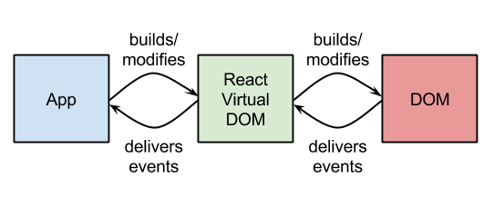

# React 第一天

## 一、浏览器原理

### 1.1 浏览器主要功能


### 1.2 浏览器组成部分


### 1.3 主要渲染引擎


### 1.4 渲染引擎


1 用户的请求资源通过浏览器的网络层到达渲染引擎后，渲染引擎开始工作。

2 每次渲染的文档不会超过8k的数据块。

3 渲染引擎的职责就是渲染，在浏览器窗口显示所有请求内容

### 1.5 两棵树

DOM Tree 全称document object model，即我们所熟知的文档对象模型，我们可以把它看成html元素对外的接口，有了这些接口javascript开发人员才能实现复

杂的页面功能，DOM树的根节点就是document对象。DOM Tree是的基本单位是node节点，包含整个html文档的各个tag，主要反应整个webpage情况，是对

webpage的一个写真。

Render Tree 由一些包含颜色大小等属性的矩形组成，它们将按照正确的顺序显示在屏幕上，Render Tree最小单元是RenderObject，Render Tree每个单元都涉

及页面中某块区域的布局和渲染，因此一些不涉及区域渲染的节点在Render Tree中是不存在的

### 1.6 layout

布局 RenderObject构造出来并没有立即添加在Render Tree上，它并没有位置跟大小的信息，为他确定这些信息的过程我们称之为布局

 html采取了一种流式布局的布局模型，从上到下，从左到右顺序布局，布局的起点是从Render Tree的根节点开始的，对应DOM Tree的根节点(document)，初始

位置坐标为(0,0 )

流程：每个RenderObject的宽度是由父节点的RenderObject确定，父节点遍历子节点，确定子节点的位置(x,y)，调用子节点的Layout方法确定其高度，父节点根

据子节点的height，margin，padding确定自身的高度。

### 1.7 全局layout与增量layout

全局Layout 当Layout在整棵渲染树上触发时。例如：

​	 一个全局样式改变影响所有渲染对象时，比如字号的改变

​	 窗口Resize 

增量Layout 只有标记为dirty的会重新布局(也将导致一些额外的布局)。增量Layout会在渲染对象dirty是异步触发。例如：当网络接收到新的内容并添加到DOM树

后，新的渲染对象会添加到渲染树中。

dirty bit系统 为了不因为每个小的变化都全部重新布局，浏览器使用了一个dirty bit系统，一个渲染对象发生了变化或者被添加了，就标记它及其子元素为dirty，

一一需要layout。存在两个标示，dirty以及children are dirty，children are dirty说明即使这个渲染对象没有问题，但它至少有一个child需要layout

### 1.8 painting

绘制阶段 遍历渲染树，并调用渲染对象的paint方法，将它们的内容显示在屏幕上，绘制使用ui基础组件css2定义的渲染顺序 一个块对象的渲染顺序是：


这个就是元素压入堆栈的顺序，这个顺序影响着绘制，堆栈从后向前进行绘制。

### 1.9 渲染引擎线程

渲染引擎是单线程的，除了网络操作外，几乎所有的事情都在单一的线程中处理，在Firefox和Safari中，就是浏览器主线程，chrome中是tab的主线程。

网络操作由几个并行线程执行，并行的链接个数是受限制的（通常是2-6个）

浏览器的主线程是一个事件循环，他被设计成无限循环以保持执行过程中可用，等待事件(例如layout和paint事件)并执行他们。

### 1.10 webkit 详解渲染流程


以上步骤是一个渐进过程，为了提高用户体验，渲染引擎视图尽可能快的把结果显示给用户，他不会等待所有html都被解析完才创建并布局渲染树，它会从网络层

获取文档内容的同时把已经接收到的局部内容先展示出来。

## 二、建设高性能网站

### 2.1 高性能网站

减少HTTP连接请求

把部分内容压缩

避免CSS表达式

减少DNS查找

避免重定向连接

避免大量DOM操作

... ...

### 2.2 性能瓶颈之DOM操作开销

对DOM操作的代价是高昂的，这在网页应用中的通常是一个性能瓶颈。

在《高性能JavaScript》中这么比喻：“把DOM看成一个岛屿，把JavaScript(ECMAScript)看成另一个岛屿，两者之间以一座收费桥连接”。所以每次访问DOM都会

交一个过桥费，而访问的次数越多，交的费用也就越多。所以一般建议尽量减少过桥次数。

### 2.3 减少DOM操作

对DOM元素的增删改查会造成页面的Repaint和Reflow，循环对DOM操作更是罪恶的行为。所以合理的使用JavaScript变量储存内容，在循环结束时一次性写入。

减少对DOM元素的查询和修改，查询时可将其赋值给局部变量。

### 2.4 来自React的革命性的创新

由于React的设计思想极其独特，性能出众，代码逻辑非常简单。被越来越多的人关注和使用，认为它将是未来Web开发的主流工具。

特点：

​	 高效：React通过对DOM的模拟，最大限度地减少与DOM的交互

​	 组件化：React采取组件化开发，极大限度的使组件得到复用，便于开发管理与维护

​	 适用多端：一处开发，多端适用，将颠覆整个互联网行业

### 2.5 Virtial DOm -- 虚拟DOM

传统的web应用，操作DOM一般是直接更新操作的，但是我们知道DOM更新通常是比较昂贵的。而React为了尽可能减少对DOM的操作，提供了一种不同的而又

强大的方式来更新DOM，避免直接操作DOM。就是Virtual DOM。一个轻量级的虚拟的DOM，就是React抽象出来的一个对象，用来描述DOM应该什么样子的，

应该如何呈现。通过这个Virtual DOM去更新管理真实的DOM。


注：虚拟DOM有的人也翻译成react元素

### 2.6 虚拟DOM的实现原理

传统开发中，当app内部状态改变时，会直接修改DOM，造成一定的操作开销，如果同时触发多个事件，事件就会不停的对DOM操作，而产生开销膨胀。




在React中，对虚拟DOM的操作, 不会立刻映射到真实DOM上，这使得React能够等待，直至事件循环结束, 在此之前完全不用操作真实的DOM。React会计算出虚

拟DOM的变化（ diff ），并以尽少的操作将diff作用到真实的DOM上。批量DOM操作以及虚拟DOM的变化检测将由React处理完成。

### 2.7 虚拟DOM的变化检测


当修改虚拟DOM时候，React会将修改的虚拟DOM节点标记为修改过（ dirty ）,在事件循环结束时，会对所有修改过的虚拟DOM节点进行处理，并映射到真实

DOM

### 2.8 虚拟DOM例子

例如，在DOM处在左侧状态时，我们操作应用程序，为每一个容器设置内容，那么当虚拟DOM检测改变后不会重新创建9个容器，也不会将原来9个容器删除，因

为这样开销很大，React会对比左右两种状态，发现只有容器内容发生变化了，因此它会将新的内容设置在9个容器中，减少其他操作，提高性能。


### 2.9 为什么要组件化开发

无论是前端还是后端，在产品确定情况下优化成本有两个途径：减少部署成本，提高开发效率。

​	 减少部署成本方面，我们可以将产品迁移到开源的易替换的产品集群等，优化方式有很多。

​	 但对于我们前端来说提高开发效率才是最主要的优化途径。

​			 提高开发效率这方面，主要途径有两点：加快开发速度，减少变更代价。

如何提高开发速度？

​	 我们在开发中不要重造轮子，如果可以利用已有的产品，那么开发效率将极大提高。

如何减少变更代价？

​	 如果我们能够理清模块之间的关系，合理分层，每次变更只需要修改其中某个部分。如果不用修改代码，仅仅改变配置就可以，岂不是更好了


### 2.10 页面切割

 React的组件开发类似组合模式(先分后和)，将整个页面进行细度切割，划分成一个个子组件，然后针对于一个个子组件进行开发、更新、迭代，当然对于相同功

能的组件我们是可以复用的（例如图中黄色组件部分），最终再由这些子组件重新组装成新的页面。


### 2.11 一个组件切割的例子


### 2.12 多选适配

多端适配：一处开发，多端适用，将颠覆整个互联网行业。为了实现多端适配的混合开发，React将拆分成两类库：一类是核心库：react。一类是渲染库：浏览器

端使用react-dom


## 三、React

### 3.1 获取React

Git地址

​	 https://github.com/facebook/react

获取React

​	 npm install react react-dom

​			 注：在ES5开发中，可以通过bower获取react.js和react-dom.js文件

​	 我们使用最新版本，只能使用ES6开发

### 3.2 创建虚拟DOM

核心库：react提供了createElement方法用来创建虚拟DOM

​	 第一个参数表示虚拟DOM名称（也可以是组件名称）

​	 第二个参数表示虚拟DOM的属性对象

​	 从第三个参数开始，表示子虚拟DOM

### 3.3 虚拟DOM

虚拟DOM是一个普通的JS对象，存储一些必要属性来描述DOM。

​	 type 表示虚拟DOM类型

​	 key 表示虚拟DOM的id

​	 ref  表示对真实DOM的引用

​	 props 表示虚拟DOM中所有属性对象

​			  children 表示虚拟DOM的子虚拟DOM

​				 	  字符串 表示一个文本节点

​					   对象  表示一个虚拟DOM

​					   数组  表示多个虚拟DOM或者文本。

### 3.4 渲染虚拟DOM

浏览器端渲染库react-dom，提供了render方法，可以渲染虚拟DOM。

​	 第一个参数表示虚拟DOM

​	 第二个参数表示真实DOM容器元素

​	 第三个参数是回调函数，表示渲染完成执行的方法。

```jsx
// 引入核心库
// import * as React from 'react';
// 引入默认接口的方式都是一样的
import { createElement } from 'react';

// 引入浏览器端渲染库
// import * as ReactDom from 'react-dom';
// 解构对象
import { render, unmountComponentAtNode } from 'react-dom';


// 创建虚拟DOM
// <h1 title="hello title">我是h1</h1>


// 第一个参数表示虚拟DOM名称（也可以是组件名称）
// 第二个参数表示虚拟DOM的属性对象
// 从第三个参数开始，表示子虚拟DOM
// let h1 = createElement('h1', { title: 'hello title' }, '我是h1');

// children		表示虚拟DOM的子虚拟DOM
    // 字符串		表示一个文本节点
    // 对象			表示一个虚拟DOM
    // 数组			表示多个虚拟DOM或者文本。
// let h1 = createElement('h1', { title: 'hello title' }, createElement('span', null, '我是span'));

// 多个虚拟DOM
let h1 = createElement('h1', { title: 'hello title' }, createElement('span', null, '我是span'), '文本内容');


// 渲染虚拟Dom
    // 第一个参数表示虚拟DOM
    // 第二个参数表示真实DOM容器元素
    // 第三个参数是回调函数，表示渲染完成执行的方法。
render(h1, document.getElementById('app'), () => {
    console.log('我渲染上树了');
})

// 3s之后卸载app
setTimeout(() => {
    // 将虚拟DOM从页面中删除
    unmountComponentAtNode(app);
}, 3000);
```


### 4.5 组件

虚拟DOM与页面中的真实DOM相对应，因此一个虚拟DOM对应一个真实DOM。

如果页面中有很多真实DOM，我们就要创建很多虚拟DOM。

为了复用虚拟DOM，react提供了组件技术。

​	 定义组件就是定义一个类：

​			 在ES5开发中，通过React.createClass方法创建组件类

​			 在ES6开发中，通过class定义组件类

​				 语法 class 组件类名 {}

​			 注意：类名首字母大写。

由于所有的组件都有相似的行为，所以React将这些相似的行为封装在Component组件基类中。

所以为了让我们定义的组件具有这些行为，就要继承组件基类Component。

​	 语法 class 组件类名 extends Component {}

​		 为了渲染虚拟DOM，我们要在类中定义render方法。

​				 其返回值就是虚拟DOM。

​				 返回的虚拟DOM中，最外层有且只有一个根节点、

注：渲染库的render方法和组件的render方法没有任何关系。

渲染库的render方法只能渲染虚拟DOM，不能渲染组件，想渲染组件，要通过createElement方法将组件转成虚拟DOM。

```jsx
// 引入核心库
import { createElement, Component } from 'react';

// 引入浏览器端渲染库
import { render } from 'react-dom';


// 没有继承 组件实例化的时候 没有任何数据
// class Demo {

// }

// 定义组件类 （继承之后 会有特定的属性和方法）
class Demo extends Component {
    // 定义render渲染方法
    render() {
        // 返回值就是渲染的虚拟DOM
        return createElement(
            'ul',
            null,
            createElement('li', null, '携程旅行网'),
            createElement('li', null, '好看视频'),
            createElement('li', null, '淘宝网'),
        )
    }
}

// let d = new Demo();
// console.log(d);


// 通过render方法渲染Demo类
    // 不能直接渲染类
// render(Demo, document.getElementById('app'));

// 将类转为虚拟DOM才可以渲染
render(createElement(Demo), document.getElementById('app'));
```


### 3.6 jsx语法

我们创建虚拟DOM太麻烦了，不如在html页面中创建元素方便。

react团队为了让我们创建虚拟DOM更方便，提供了jsx语法：像创建XHTML元素一样，创建虚拟DOM。

​	 在xhtml中创建div：  \<div>\</div>

​	 在jsx语法中创建div： \<div>\</div>

​	 在xhtml中创建input： \<input type="text" />

​	 在JSX语法中创建input：  \<input type="text" />

JSX语法已经被纳入ES2017规范了。

目前浏览器不支持JSX语法，因此我们要编译JSX语法。

### 3.7 编译jsx语法

我们编译ES6语法使用：es2015或env编译器

我们编译jsx语法使用：react编译器

我们既想编译ES6语法，也想编译jsx语法，就要同时使用es2015与

react编译器。在webpack4.0中，我们要使用最新的编译器：

​	 [‘@babel/preset-env’, ‘@babel/preset-react’]

拓展名

​	 为了区分ES5语法和ES6语法，我们将文件拓展名定义成.es

​	 为了区分ES5语法和jsx语法，我们可以文件的拓展名定义成 .esx, .jsx, .tsx, .es6x ......

​	 为了语义化，react团队建议我们定义成.jsx

```jsx
// 引入核心库
import React, { createElement, Component } from 'react';
// 引入浏览器端渲染库
import { render } from 'react-dom';

// 定义组件类 （继承之后 会有特定的属性和方法）
class Demo extends Component {
    // 定义render渲染方法
    render() {
        // 有且只有一个根元素
        return (
            <div>
                <ul>
                    <li>携程旅行网</li>
                    <li>好看视频</li>
                    <li>淘宝网</li>
                </ul>
                <h1>hello h1</h1>
            </div>
        )
    }
}

//将类转为虚拟DOM才可以渲染
    // 当渲染之后 在源码中使用的是React.createElement 所以在上面要引入React变量
// render(createElement(Demo), document.getElementById('app'));

// jsx语法
// render(<Demo></Demo>, app);
render(<Demo />, app);


// js解析过程: 1 声明提升  2 代码补全 （分号）

// function fn() {
//     return 123;
// }

// function fn() {
//     return {
//         a: 1,
//         b: 2
//     };
// }

// function fn() {
//     return ;
//         {
//             a: 1,
//             b: 2
//         }
// }

// function fn() {
//     return (
//         {
//             a: 1,
//             b: 2
//         }
//     );
// }


// console.log(fn());
```


### 3.8 插值

已经学过的插值语法：

​	 ejs模板 <%=key%> 

​	 ES6  ${key} 

​	 微信  {{key}}  伪js环境

​	 less  @{key} 

​	 scss #{$key} 

​	 vue  {{key}} 

由于JSX语法不是js环境，因此不能使用变量，想使用表达式（变量等）就要通过插值语法，创建一个js环境。

​	 插值语法： {}

​		 是一个真正的js环境，可以书写复杂的表达式。

​		 由于插值语法提供的是真正的js环境。因此可以继续使用jsx语法。

​	 注：js语法与jsx语法可以嵌套使用。


### 3.9 注释

jsx语法既不是html环境也不是js环境，

 	因此既不能使用html中的注释，也不能使用js中的注释，

​	 插值可以提供js环境，因此可以在js环境中书写js注释

注意：不要注释掉插值闭合符号，所以工作中多行注释更常用。

```jsx
// 引入核心库
import React, { createElement, Component } from 'react';
// 引入浏览器端渲染库
import { render } from 'react-dom';

// 定义数据
let msg = 'hello msg';
// let msg = '';

// 获取当前的日期
let date = new Date();

class Demo extends Component {
    // 定义render渲染方法
    render() {
        return (
            <div>
                <h1>hello h1-- msg</h1>
                <hr />
                {/* {里面是真正的js环境} */}
                <h1>{msg}</h1>
                {/* 可以定义表达式 */}
                <h1>{msg.toUpperCase() + '!!!'}</h1>
                {/* 展示今天的日期 */}
                <h1>{date.getFullYear() + `/${date.getMonth() + 1}/${date.getDate()}` }</h1>
                {/* 使用三目运算 */}
                {msg ? <a href="">{msg}</a> : 'hello msg123'}

                {// 必须换行
                asdasd}

                {/*
                    以后使用多行注释比较多
                    快捷键: ctrl + /  (可以在vs code中自定义)          
                
                */}
            </div>
        )
    }
}

//将类转为虚拟DOM才可以渲染
render(<Demo />, app);


```


### 3.10 虚拟DOM的四类属性

虚拟DOM有四类属性：自定义属性，元素属性，特殊元素属性，非元素属性。

**自定义属性**：是用来存储数据的。没有特殊含义。

 html5中，自定义属性建议以data-开头。

**元素属性**：对于元素来说有特殊的含义。例如：id, title, style等

 注：style的属性值只能是对象。如：style={{ key: value }}

 外面的{}表示插值符号，内部的{}表示对象符号，样式名称要使用驼峰式命名

 注：如果样式属性值表示长度单位，并且单位是像素，则像素可以省略

**特殊元素属性**：虚拟DOM有两个常见的特殊元素属性class和for。它们命中了关键字以及保留字。

 所以：class 要写成 className。for 要写成 htmlFor

**非元素属性**：是由React拓展的，不是DOM元素默认的属性，如：ref, dangerouslySetInnerHTML, key

 非元素属性是react提供的功能，类似vue中的指令。

### 3.11 非元素属性 -- ref

**ref**：允许我们在组件中获取虚拟DOM对应的真实DOM元素（也可以是自定义组件）。

​	 例如：在componentDidMount（组件创建完成）方法中获取

​		 分成两步：第一步 为元素设置ref属性，第二步 在组件中，通过this.refs获取对应的元素。

 注意：如果获取的是元素，则是源生的DOM元素，因此要通过源生的DOM API操作。

 通常在一些第三方插件中使用

​		 我们直接操作真实DOM元素就跳过了虚拟DOM环节，因此这些操作会被React忽略。无法被虚拟DOM优化，工作中慎用。

### 3.12 非元素属性 -- dangerouslySetInnerHTML

用危险的（不合法的）方式设置元素的内容。

 不合法的方式有：

​	 1 不能使用行内式样式字符串。

​	 2 不能直接使用特殊元素属性。

​	 3 不能渲染标签等等 ... ...

我们可以借助dangerouslySetInnerHTML属性实现这些功能。属性值是对象，通过__html设置内容。

注意：

​	 1 该属性也是直接对真实DOM元素设置innerHTML属性，因此跳过了虚拟DOM优化环节，工作中慎用。

​	 2 设置的内容要保证是安全的。否则可能会被攻击。

### 3.13 非元素属性 -- key

为列表中的虚拟DOM设置id。

虚拟DOM可以包含一个子虚拟DOM或者文本，也可以包含多个子虚拟DOM（是数组）

​	 当包含多个子虚拟DOM的时候，就是一个数组，

​	 此时要为每一个成员设置key属性。

注意：每一个数组中，key属性值要唯一并且稳定、可预测。

```jsx
// 引入核心库
import React, { Component, createElement } from 'react';
// 引入渲染库
import { render } from 'react-dom';

// 定义变量
let a = '<a href="javascript:void(alert(123))">我是a标签</a>';

// 定义数组
let list = [
    <li key="1">好看视频</li>,
    <li key="2">淘宝网</li>,
    <li key="3">哔哩哔哩</li>
]

// 定义组件类
class Demo extends Component {
    // 生命周期钩子
    // componentDidMount() {
    //     // console.log(111, this);
    //     // 获取对应的真实DOM
    //     // console.log(this.refs.h2);
    //     // 通过源生元素的api操作

    //         // 注意： 我们直接操作真实DOM元素就跳过了虚拟DOM环节，因此这些操作会被React忽略。无法被虚拟DOM优化，工作中慎用。
    //     this.refs.h2.style.color = 'green';
    // }

    // 定义方法
    createList() {
        return ['好看视频', '淘宝网', '哔哩哔哩'].map((item, index) => <li key={index}>{item}</li>);
    }

    // 渲染方法
    render() {
        return (
            <div>
                <h1>hello demo</h1>
                <hr />
                {/* 1 自定义属性数据 */}
                <h1 data-name="demo">hello h1</h1>
                <hr />
                {/* 2 元素属性：对于元素来说有特殊的含义。例如：id, title, style等 */}
                {/* style属性值是对象 ： 外部是插值语法 为了提供js环境 内部真正的对象 */}
                <h1 id="box" title="nihao" style={{
                    color: 'red',
                    // 如果单位是长度 并且是像素单位可以省略
                    width: 100,
                    // 'font-size': 30
                    // 要转为驼峰式命名
                    fontSize: 30,

                    // 行高属性不能省略单位
                    lineHeight: '30px'
                }}>hello word</h1>
                <hr />

                {/* 3 特殊元素属性: class for */}
                {/* class 改为 className */}
                <div className="box1">hello box1</div>
                <hr />
                {/* for 改为 htmlFor */}
                <label htmlFor="username">用户名:</label>
                <input type="text" id="username" />
                <hr />

                {/* 4 非元素属性: ref dangerouslySetInnerHTML  key */}
                {/* ref: 对某个元素或者是组件的引用 */}
                <h2 ref="h2">我是h2</h2>

                {/* dangerouslySetInnerHTML： 可以设置标签的 设置的内容一定式安全可靠 */}
                <h2>{a}</h2>
                <h2 dangerouslySetInnerHTML={{ __html: a }}></h2>
                <hr />

                {/* key属性: 当渲染列表的时候 要设置key 并且是唯一的 稳定的 */}
                <ul>
                    <li>好看视频</li>
                    <li>淘宝网</li>
                    <li>哔哩哔哩</li>
                </ul>
                <hr />

                {/* 渲染一个数组 */}
                <ul>{list}</ul>

                {/* 执行一个方法渲染列表 (后面常用) */}
                <ul>{this.createList()}</ul>

            </div>
        )
    }
}

// 渲染虚拟DOM
render(<Demo></Demo>, app);

```

