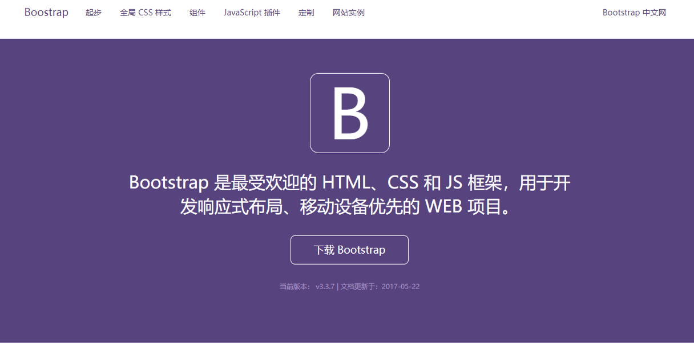

# React 第4天

## 一、项目实战

### 1.1 项目介绍

我们基于react实现boostrap中文网。

技术架构：我们使用了react, jsx, ES6, ES Module, Bootstrap, less, webpack等技术，实现bootstrap中文网

### 1.1 目录部署

 data  异步请求

 img  所有图片

 css  css库文件

 src 开发目录

 	 components 组件

 	 pages  页面

​	  App  应用程序组件

​	  base.less  less配置

​	  main.jsx  入口文件

 webpack.config.js 配置文件 

注：组件命名规范 -- 组件文件与目录首字母都大写。

效果图


## 二、React

### 2.1 混合

react提供了组件技术，是为了复用虚拟DOM。

react提供了混合技术，是为了复用组件（数据和方法）。

​	 在ES5开发中，通过mixins定义混合。

​	 在ES6开发中，提供了extends继承关键字，因此可以通过extends实现混合继承。使用混合分成两步：

​			 第一步 定义混合类，继承组件基类（Component）

​			 第二步 定义组件类，继承混合类

注意：

​	 由于混合类继承了组件基类，因此混合类中就具有了组件的行为方法。

​	 由于组件类继承了混合类，因此就间接的继承了组件基类中的行为方法。

​	 使用混合继承之后，我们还可以重写属性和方法，此时根据就近原则会优先使用我们重写的。

```js
// 引入核心库
import React, { Component } from 'react';
// 引入模块
// import PropTypes from 'prop-types';


// 引入Header组件
import Header from '../components/Header/Header';
// 引入Home组件
import Home from '../pages/Home/Home';
import Start from '../pages/Start/Start';
import Css from '../pages/Css/Css';
import Page from '../pages/Page/Page';

// 暴露接口
export default class App extends Component {
    // 定义构造函数
    constructor(props) {
        super(props);
        this.state = {
            // page: 'css'
            // 实现从外流向内部
            page: props.page
        }
    }
    


    // 定义渲染页面方法
    renderPage() {
        switch (this.state.page) {
            case 'start':
                return <Start></Start>
                // return <Page  title="起步" intro="简要介绍 Bootstrap，以及如何下载、使用，还有基本模版和案例，等等。。" url="/data/start.json" ></Page>
            case 'css':
                return <Css></Css>
                // return <Page  title="全局 CSS 样式" intro="设置全局 CSS 样式；基本的 HTML 元素均可以通过 class 设置样式并得到增强效果；还有先进的栅格系统。" url="/data/css.json" ></Page>

            case 'component':
                return <Page  title="组件" intro="无数可复用的组件，包括字体图标、下拉菜单、导航、警告框、弹出框等更多功能。" url="/data/component.json" ></Page>
            case 'js': 
                return <Page  title="JavaScript 插件" intro="jQuery 插件为 Bootstrap 的组件赋予了“生命”。可以简单地一次性引入所有插件，或者逐个引入到你的页面中。" url="/data/js.json" ></Page>
            case 'marker':
                return <Page  title="定制并下载 Bootstrap" intro="通过自定义 Bootstrap 组件、Less 变量和 jQuery 插件，定制一份属于你自己的 Bootstrap 版本吧。" url="/data/marker.json" ></Page>
            default:
                return <Home ></Home>
        }
    }

    render() {

        // 解构数据
        let { page } = this.state;
        return (
            <div className="app-part">
                {/* 定义Header组件 */}
                {/* 实现header组件中choose类的切换 子向父通信的过程 */}
                <Header page={page} method={ page => this.setState({ page }) }></Header>
                {this.renderPage()}
            </div>
        );
    }
}

// // 属性的约束
// App.propTypes = {
//     page: PropTypes.string.isRequired
// }

// 定义默认数据
App.defaultProps = {
    page: 'home'
}


```

