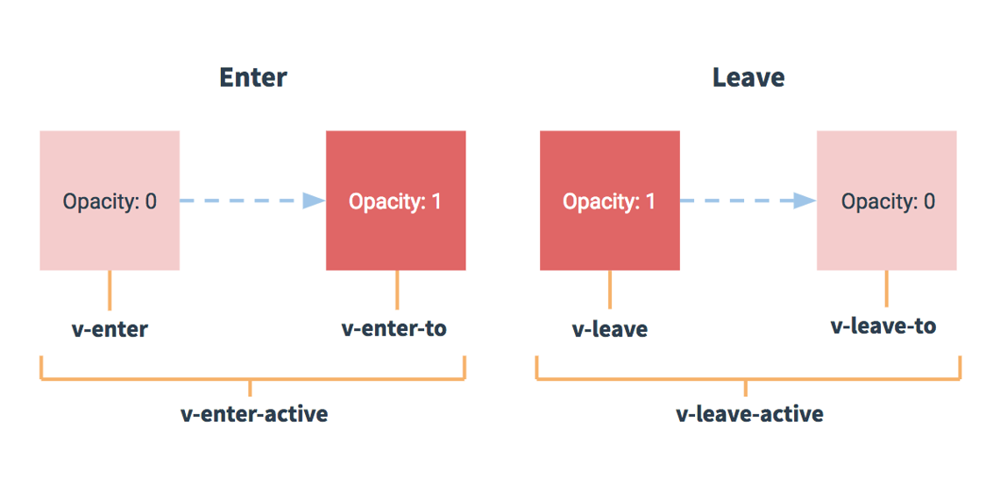

# Vue	第三天

## 一、Vue

## 1.1 过渡

我们学习v-show指令和v-if指令，这些指令可以显示隐藏元素或者创建删除元素。

vue允许我们在显示隐藏元素以及创建删除元素过程中，添加过渡效果。

transition元素(组件)是由vue提供的。可以为内部的元素添加过渡效果。

​		 通过name属性设置过渡名称，之后就会根据该名称创建六个类， 

​		例如 name=”ickt”

​				 表示显示的过程（由隐藏的状态变成显示的状态）

​						 .ickt-enter .ickt-enter-to .ickt-enter-active

​				 表示隐藏的过程（由显示状态变成隐藏的状态）

​						 .ickt-leave .ickt-leave-to .ickt-leave-active

​		我们基于这六个类，实现css过渡或者动画（借助于css3实现的）

```js
<!DOCTYPE html>
<html lang="en">
<head>
    <meta charset="UTF-8">
    <meta http-equiv="X-UA-Compatible" content="IE=edge">
    <meta name="viewport" content="width=device-width, initial-scale=1.0">
    <title>Document</title>
</head>
<body>
    <!-- 视图 -->
    <div id="app">
        <button @click="isShow = !isShow">切换显隐</button>
        <!-- 利用transition元素包裹 -->
        <!-- appear 实现入场过渡：当元素加载的时候，执行动画。 -->
        <transition name="hello" appear>
            <div class="box" v-show="isShow"></div>
        </transition>
    </div>
    <!-- 引入发布之后的文件 -->
    <script src="./dist/03.js"></script>
</body>
</html>
```

**入场过渡**

​		 我们通过为transition组件添加appear属性，实现入场过渡：当元素加载的时候，执行动画。

**过渡事件**

css3过渡和动画有事件，我们可以通过DOM监听到。

​		 过渡事件：webkitTransitionStart，webkitTransitionEnd

​		 动画事件：webkitAnimationStart, webkitAnimationEnd.

vue实现的过渡也可以监听动画开始与结束的事件，

​		显示过程：

​				 before-enter：处于隐藏状态；after-enter：处于显示状态；enter：显示过程

​		隐藏过程

​				 before-leave：处于显示状态；after-leave：处于隐藏状态；leave：隐藏过程

​		我们可以通过v-on指令或者是@语法糖来监听这些事件。

**多元素过渡**

我们可以在transition中，定义多个元素，实现多个元素之间的过渡。

​		 内部的元素必须设置key属性，属性值是唯一的。

我们通过mode属性定义切换模式：

​		 in-out 新元素先执行，再执行当前的元素

​		 out-in 当前的元素先执行，再执行新元素。

​		 默认两个元素同时执行。

```html
<!DOCTYPE html>
<html lang="en">
<head>
    <meta charset="UTF-8">
    <meta http-equiv="X-UA-Compatible" content="IE=edge">
    <meta name="viewport" content="width=device-width, initial-scale=1.0">
    <title>Document</title>
</head>
<body>
    <div id="app">
        <button @click="isShow = !isShow">toggle</button>
        <transition 
            name="demo" 
            appear
            @before-enter="beforeEnter"
            @after-enter="afterEnter"
            @enter="enter"
            @before-leave="beforeLeave"
            @after-leave="afterLeave"
            @leave="leave"
        >
            <div class="box" v-if="isShow"></div>
        </transition>
    </div>
    <script src="./dist/06.js"></script>
</body>
</html>
```


### 1.2 列表过渡

我们通过v-for指令渲染列表。

使用v-for指令创建列表元素的时候，如果需要过渡，要使用transition-group组件。

​		 与transition组件的区别是：transition-group会渲染成一个真实的元素，

​				 默认是span，通过tag属性可以自定义渲染的结果。

使用列表过渡的时候，每一个元素都要添加一个值是唯一的并且稳定的key属性。

transition与transition-group的区别：

​		 transition 控制一个元素

​		 transition-group 控制多个元素

```html
<!DOCTYPE html>
<html lang="en">
<head>
    <meta charset="UTF-8">
    <meta http-equiv="X-UA-Compatible" content="IE=edge">
    <meta name="viewport" content="width=device-width, initial-scale=1.0">
    <title>Document</title>
</head>
<body>
    <!-- 视图 -->
    <div id="app">
        <button @click="random">随机位置</button>
        <button @click="addItem">随机添加成员</button>
        <!-- 利用transition元素包裹 -->
        <transition-group name="hello" tag="div" class="box_group"> 
            <span v-for="(item, index) in spans" :key="item">{{item}}</span>
        </transition-group>
    </div>
    <!-- 引入发布之后的文件 -->
    <script src="./dist/06.js"></script>
</body>
</html>
```


### 1.3 自定义指令

指令是对DOM元素的拓展，使其具有一定的行为特征（功能）。

我们已经学习的指令：

​		 v-bind, v-text, v-html, v-once, v-model, v-cloak, v-on, v-show, v-if, v-else-if, v-else, v-for等等。

内置的指令是有限的，有时候我们需要对元素拓展更多的功能，我们要自定义指令。

自定义指令只需要两步，

​	 第一步，在模板中使用：指令都是以v-为前缀，字母小写，横线分割单词。

​	 第二步，在js中定义指令。有两种定义方式

​			 第一种：全局定义：Vue.directive(name, fn | {})

​					 全局定义的指令可以在所有vue实例化对象（组件）中使用

​					 directive方法不能解构，要在vue实例化对象之前定义。

​			 第二种：局部定义：directives: { name: fn | {} }

​					 局部定义的指令只能在当前vue实例化对象(组件)中使用

​					 name表示指令的名称：省略v-前置，使用驼峰式命名

​					{}表示指令对象，可以定义一些方法

​							 bind ：将指令绑定给元素时候执行的方法；

​							 update：指令的属性值发生改变的时候执行的方法

​							 unbind：指令从元素上解除绑定时候执行的方法；

​							 inserted：指令所在的元素从页面中删除时候，执行的方法；

​							 componentUpdated：指令所在的组件更新的时候执行的方法。

​					 fn表示指令函数，处理方法。

​					 不论是指令对象中的方法，还是指令函数，都有四个参数

​							 第一个参数表示指令所在的元素。

 							第二个参数 表示指令对象，包含指令的一些信息

​									 例如：指令名称，属性值表达式，当前的属性值，上一个属性值等等

​							 第三个参数表示当前的虚拟DOM对象。

​							 第四个参数表示上一个虚拟DOM对象

注意：当多次使用指令的时候，一个指令的属性值改变，所有指令相关的回调函数都会执行。

为了提高性能，我们可以在回调函数中判断当前的值与上一个值是否相同，不同再执行。

请实现以下指令 

​		 v-ickt-html => v-html

​		 v-ickt-once  =>  v-once

​		 v-ickt-show =>  v-show

 注：工作中，我们自定义的指令通常带有命名空间前缀。

```html
<!DOCTYPE html>
<html lang="en">
<head>
    <meta charset="UTF-8">
    <meta http-equiv="X-UA-Compatible" content="IE=edge">
    <meta name="viewport" content="width=device-width, initial-scale=1.0">
    <title>Document</title>
</head>
<body>
    <!-- 视图 -->
    <div id="app">
        <input type="text" v-model="msg">
        <h1>{{msg}}</h1>
        <h1 v-html="'v-html: ' + msg"></h1>
        <hr>

        <!-- v-ickt-html	=>	v-html -->
        <h1 v-ickt-html="'我是实现的html指令:' + msg">hello h1</h1>
        
        <!-- 再次使用v-ickt-html指令 -->
        <h1 v-ickt-html="'我是实现的html指令: ' + title">hello title</h1>
        
        
        <!-- v-ickt-once 	=> 	v-once -->
        <h1 v-ickt-once="'我是实现的once指令: ' + msg"></h1>
        <hr>


        <button @click="isShow = !isShow">切换显隐</button>
        <h1 v-show="isShow">hello show</h1>
        <!-- v-ickt-show	=> 	v-show -->
        <h1 v-ickt-show="isShow">我是实现的指令: hello show222</h1>


    </div>
    <!-- 引入发布之后的文件 -->
    <script src="./dist/07.js"></script>
</body>
</html>
```


