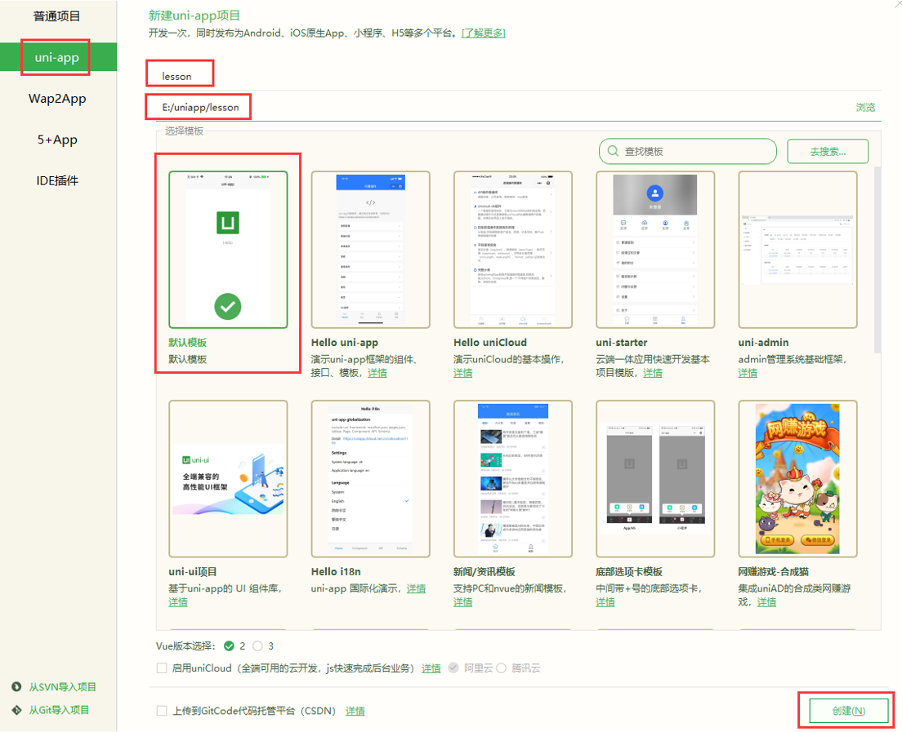
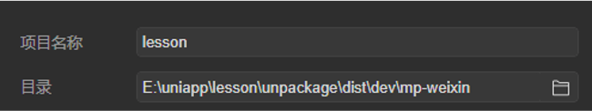
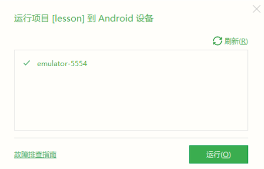
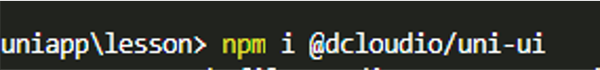
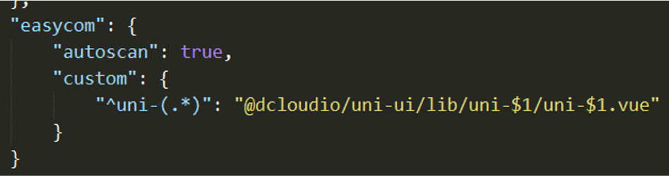
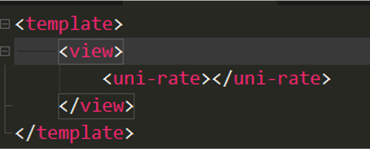

# Vue 第十四天

## 一、uni-app

### 1.1 uni-app介绍

uni-app是一个基于vue框架开发所有端应用的框架，开发者编写一套代码，可发布到iOS、Android、H5、以及各种小程序（微信/支付宝/百度/头条/QQ/钉钉）

等多个平台。

 	具有vue和微信小程序的开发经验，可快速上手uni-app

为什么要去学习uni-app？

 	减少了学习成本，因为只学会uni-app之后，即可开发出iOS、Android、H5、以及各种小程序的应用，不需要再去学习开发其他应用的框架，相对公司而言，

也大大减少了开发成本

### 1.2 环境的按键

安装编辑器HbuilderX  

  	下载地址:  [https](https://www.dcloud.io/hbuilderx.html)[://www.dcloud.io/hbuilderx](https://www.dcloud.io/hbuilderx.html)[.html](https://www.dcloud.io/hbuilderx.html)

​	  HBuilderX是通用的前端开发工具，但为uni-app做了强化

安装微信开发者工具:

 	下载地址： [https](https://developers.weixin.qq.com/miniprogram/dev/devtools/download.html)[://developers.weixin.qq.com/miniprogram/dev/devtools/download](https://developers.weixin.qq.com/miniprogram/dev/devtools/download.html)[.html](https://developers.weixin.qq.com/miniprogram/dev/devtools/download.html) 

### 1.3 创建项目

 点击HbuilderX菜单栏

​	 文件 > 项目 > 新建 > 选择uni-app > 填写项目名称 > 项目创建的目录 > 点击创建按钮



### 1.4 目录结构

pages.json 			  全局配置

​		如：页面路径、窗口样式、原生的导航栏、底部的原生tabbar 等

manifest.json  		应用的配置文件

​		如：应用的名称、图标、权限等

App.vue  				 应用程序组件

​		所有页面都在App.vue下切换，可以调用应用的生命周期函数

main.js 				 项目入口文件

​		用于初始化vue实例并安装需要的插件。

uni.scss 				整体控制应用的风格

​		预置了scss变量，如：按钮颜色、边框风格，

unpackage 		 打包目录

​		包含各个平台的打包文件

pages  				所有页面存储目录

static 				静态资源目录

​		如：图片等

components 	所有组件存放目录

### 1.5 运行项目

**（1）运行H5项目**

​	 以chrome为例

​	 运行 => 运行到浏览器（或运行到内置浏览器）=> chrome

**（2）运行小程序项目**

​		以微信小程序为例

​		 运行 => 运行到小程序模拟器 => 微信开发者工具

​		 打开微信开发者工具 => 选择小程序项目目录

​		 项目目录/unpackage/dist/dev/mp-weixin

**（3）运行App项目**

​		 以android为例

 		运行 => 运行到手机或模拟器 => 运行到Android App基座 => 选择模拟器

​		 注意：模拟器API版本建议是30版本，版本太高，太低有兼容性问题


![[images/vue2.png]]




### 1.6 配置

**更换图标**

点击“mainifest.json文件”=>“App图标配置”=>“浏览” =>“自动生成所有图标并替换” ，替换图标


**page.json配置**

​	globalStyle 定义全局配置

​			 navigationBarTextStyle 导航栏标题颜色及状态栏前景颜色，仅支持 black/white

​			 navigationBarTitleText 导航栏标题文字内容

​			 navigationBarBackgroundColor 导航栏背景颜色（同状态栏背景色），如"#000000"

​			 backgroundColor 窗口的背景色

​	pages 配置页面（第一个成员为首页）

​			 style 页面样式配置

​			  navigationBarTitleText 页面导航栏标题文字内容

​			 enablePullDownRefresh 是否开启下拉刷新

```json
{
	"pages": [ //pages数组中第一项表示应用启动页，参考：https://uniapp.dcloud.io/collocation/pages
		{
			"path": "pages/index/index",
			"style": {
				"navigationBarTitleText": "uni-app"
			}
		}
	    ,{
            "path" : "pages/demo/demo",
            "style" :                                                                                    
            {
				// 页面配置
                "navigationBarTitleText": "hello",
                "enablePullDownRefresh": false
            }
            
        }
        ,{
            "path" : "pages/data/data",
            "style" :                                                                                    
            {
                "navigationBarTitleText": "",
                "enablePullDownRefresh": false
            }
            
        }
        ,{
            "path" : "pages/directive/directive",
            "style" :                                                                                    
            {
                "navigationBarTitleText": "",
                "enablePullDownRefresh": false
            }
            
        }
        ,{
            "path" : "pages/request/request",
            "style" :                                                                                    
            {
                "navigationBarTitleText": "",
                "enablePullDownRefresh": false
            }
            
        }
        ,{
            "path" : "pages/router/router",
            "style" :                                                                                    
            {
                "navigationBarTitleText": "",
                "enablePullDownRefresh": false
            }
            
        }
        ,{
            "path" : "pages/parent/parent",
            "style" :                                                                                    
            {
                "navigationBarTitleText": "",
                "enablePullDownRefresh": false
            }
            
        }
        ,{
            "path" : "pages/ui/ui",
            "style" :                                                                                    
            {
                "navigationBarTitleText": "",
                "enablePullDownRefresh": false
            }
            
        }
    ],
	"tabBar": {
		"list": [
			{
				"pagePath": "pages/index/index",
				"iconPath": "/static/logo.png",
				"text": "home"
			},
			{
				"pagePath": "pages/demo/demo",
				"iconPath": "/static/logo.png",
				"text": "demo"
			},
			{
				"pagePath": "pages/data/data",
				"iconPath": "/static/logo.png",
				"text": "data"
			},
			{
				"pagePath": "pages/router/router",
				"iconPath": "/static/logo.png",
				"text": "router"
			}
		]
	},
	// 全局配置
	"globalStyle": {
		"navigationBarTextStyle": "black",
		"navigationBarTitleText": "爱创乐育",
		"navigationBarBackgroundColor": "#F8F8F8",
		"backgroundColor": "#F8F8F8"
	},
	// 配置ui
	"easycom": {
		"autoscan": true,
		"custom": {
			"uni-(.*)": "node_modules/@dcloudio/uni-ui/lib/uni-$1/uni-$1.vue"
		}
	}
}

```


### 1.7 常用组件

text 文本组件，行内标签（除了文本节点以外的其他节点都无法长按选中）

view  视图容器

button 按钮

image  图片组件

 ……

 注：内置组件的属性引用微信小程序中的


### **1.8 模型数据**

模型数据的定义使用的是Vue的语法

​	 data  静态数据

​	 computed  计算属性数据

​	 watch  数据监听

​	 methods  定义方法

​	 ……

```vue
<template>
<view>
		hello ickt
	<image src="../../static/logo.png" mode=""></image>
	<button>hello</button>
	<!-- 组件和api是小程序的 -->
	<!-- 语法是vue的 -->
	<input type="text" placeholder="请输入内容" v-model="msg">
	<text @click="clickText">{{msg}}</text>
</view>
</template>

<script>
	export default {
		data() {
			return {
				msg: 'hello'
			}
		},
		// 方法
		methods: {
			clickText() {
				console.log('click text');
			}
		},
		// 监听数据变化
		watch: {
			msg(msg) {
				console.log(msg);
			}
		}
	}
</script>

<style>

</style>

```


### 1.9 插值指令

插值语法：  {{}}

 	可以使用表达式以及方法

动态属性： v-bind:    语法糖  :

绑定事件 v-on:click="fn"  语法糖  @

循环模板指令： v-for="(item, index) in arr"  :key="index"

条件模板指令： v-if， v-else-if, v-else

```vue
<template>
<view>
		<view>hello</view>
		<view v-for="item in colors" :key="item">{{item}}</view>
		<!-- 组件是小程序中的，浏览器中的不行 -->
		<!--  -->
		<!-- <h1>hello</h1> -->
		<button @click="isShow = !isShow">切换</button>
		<!-- <view v-if="isShow">part one</view>
		<view v-else>part two</view> -->
		<view v-show="isShow">demo</view>
</view>
</template>

<script>
	export default {
		data() {
			return {
				colors: ['red', 'green', 'blue'],
				isShow: true
			}
		},
		methods: {
			
		}
	}
</script>

<style>

</style>

```


### 1.10 生命周期

生命周期：一个对象从创建、运行、销毁的整个过程被成为生命周期。

 	在生命周期中每个阶段会伴随着每一个函数的触发，这些函数被称为生命周期函数

​	 uni-app继承了微信小程序的应用程序生命周期

​			 onLaunch 当uni-app 初始化完成时触发（全局只触发一次）

​			 onShow 当 uni-app 启动，或从后台进入前台显示

​			 onHide 当 uni-app 从前台进入后台

​			 onError 当 uni-app 报错时触发

uni-app支持vue与微信小程序提供的页面（组件）生命周期函数

​		微信提供：

​			 onLoad：页面加载（参数为上个页面传递的数据）

​			 onShow：页面显示（页面出现在屏幕上）

​			 onHide：页面隐藏

​			 onReady： 页面初次渲染完成

​			 onUnload：页面卸载

​	Vue提供：

​			 beforeCreate：组件创建前 

​		 	created：组件创建后 

​			 beforeMount：组件构建前 

​			 mounted：组件构建后  

​			 beforeUpdate：组件更新前 

​			 updated：组件更新后 

​			 beforeDestroy：组件销毁前 
​			 destoryed：组件销毁后

页面创建触发顺序：beforeCreate， onLoad，onShow ，created ，beforeMount ， onReady，mounted

```vue
<template>
	<view>
		data page
		<input type="text" v-model="msg">
		<view>{{msg}}</view>
	</view>
</template>

<script>
	export default {
		data() {
			return {
				msg: 'hello'
			}
		},
		methods: {
			
		},
		// 微信提供更多
		onLoad() {
			console.log('微信', 'onload');
		},
		// 微信提供更多
		onShow() {
			console.log('微信', 'onshow');
		},
		// 微信提供更多
		onHide() {
			console.log('微信', 'onHide');
		},
		// 微信提供更多
		onReady() {
			console.log('微信', 'onReady');
		},
		// 微信提供更多
		onError() {
			console.log('微信', 'onError');
		},
		// 微信提供更多
		onUnload() {
			console.log('微信', 'onUnload');
		},
		// vue提供
		beforeCreate() {
			console.log('vuew', 'beforeCreate');
		},
		// vue提供
		created() {
			console.log('vuew', 'created');
		},
		// vue提供
		beforeMount() {
			console.log('vuew', 'beforeMount');
		},
		// vue提供
		mounted() {
			console.log('vuew', 'mounted');
		},
		// vue提供
		beforeUpdate() {
			console.log('vuew', 'beforeUpdate');
		},
		// vue提供
		updated() {
			console.log('vuew', 'updated');
		},
		// vue提供
		beforeDestroy() {
			console.log('vuew', 'beforeDestroy');
		},
		// vue提供
		destroyed() {
			console.log('vuew', 'destroyed');
		},
		// vue提供
		beforeUnmount() {
			console.log('vuew', 'beforeUnmount');
		},
		// vue提供
		unmounted() {
			console.log('vuew', 'unmounted');
		}
		
		// 创建期： beforeCreate, onload, onshow, created, beforeMount, onready, mounted
		// 存在期 	beforeUpdate, updated
		// 销毁期 	onunload, beforeDesctroy, destroyed
		// tab页面切换(与前后台切换)：onshow, onhide
	}
</script>

<style>

</style>

```


### 1.11 网络请求

uni-app中的API多数出自于微信小程序，如，发送请求使用uni.request方法

​	 支持同步方法和异步方法，同步方法以sync为后缀

​			 uni-app对小程序的异步方法做了Promise封装

​	 异步方法接收数据有三种方式

​			 方式一：uni.request({ url, success, fail })

​			 方式二：uni.request({ url }).then(success)

​			 方式三：let [err, res] = await uni.request({ url })

​			 注：小程序中网络相关的 API 在使用前需要配置域名白名单，并且只支持https协议

​			 接口测试地址：https://api.aichuangleyu.com/app_news/data/list

### 1.12 数据缓存

存储数据 :

​		 同步： uni.setStorageSync  

 		异步：uni.setStorage

获取数据

​		 同步：uni.getStorageSync 

​		 异步：uni.getStorage

删除数据

​		 同步：uni.removeStorageSync 

​		 异步：uni.removeStorage 

```vue
<template>
	<view>
		request
	</view>
</template>

<script>
	export default {
		data() {
			return {
				
			}
		},
		methods: {
			
		},
		async created() {
			// 获取数据
			// 方式一：小程序语法
			// uni.request({
			// 	url: 'https://api.aichuangleyu.com/app_news/data/list',
			// 	success(data) {
			// 		console.log(111, data);
			// 	}
			// })
			// 方式二：promise规范
			// uni.request({ url: 'https://api.aichuangleyu.com/app_news/data/list' })
			// 	.then(data => console.log(456, data))
			// console.log(111);
			// 方式三：异步函数
			// let [err, data] = await uni.request({
			// 	url: 'https://api.aichuangleyu.com/app_news/data/list'
			// })
			// console.log(123, data);
			
			
			// 本地存储
			// 同步
			// uni.setStorageSync('color', 'red')
			// uni.removeStorageSync('color')
			// 异步
			// uni.setStorage({
			// 	key: 'num',
			// 	data: '100',
			// 	complete: function(res) {
			// 		console.log(res);
			// 	}
			// })
			// uni.setStorage({
			// 	key: 'num',
			// 	data: '200'
			// }).then(res => console.log(111, res))
			let [err, result] = await uni.setStorage({
				key: 'num',
				data: '300'
			})
			console.log(result);
		}
	}
</script>

<style>

</style>

```


### 1.13 导航跳转

导航跳转有两种方式：路由导航组件和路由方法

​	 路由导航（ navigator ）组件：

​			 open-type=“switchTab“ tab页面跳转

​			 普通页面跳转可以省略open-type

​	 路由方法：

​			 navigateTo 普通页面跳转

​			 switchTab tab页面跳转

​			 redirectTo 重定向跳转

​			 navigateBack  返回上级页面

```vue
<template>
	<view>
		<!-- 切换页面 -->
		<navigator url="/pages/demo/demo" open-type="switchTab">demo</navigator>
		<navigator url="/pages/directive/directive" open-type="navigate">directive</navigator>
		<!-- js方式切换 -->
		<view @click="showHome">进入home页面</view>
		<view @click="showRequest">进入request页面</view>
	</view>
</template>

<script>
	export default {
		data() {
			return {
				
			}
		},
		methods: {
			showHome() {
				// tab页面
				uni.switchTab({
					url: '/pages/index/index'
				})
			},
			showRequest() {
				// 普通页面
				uni.navigateTo({
					url: '/pages/request/request'
				})
			}
		}
	}
</script>

<style>

</style>

```


### 1.14 组件创建

在uni-app中，自定义组件使用vue语法

 创建组件：

​		 单文件组件（后缀名为.vue ）

 使用组件：

​		 通过import方式导入

​		 通过components属性注册

### 1.15 组件通信

父组件向子组件通信:

 		父组件给子组件添加属性，子组件通过props来接受数据

子组件向父组件通信：

 		（1）父组件向子组件传递方法，子组件执行方法传递数据

 		（2）父组件给子组件绑定事件，子组件通过$emit发布事件并传递数据

兄弟组件通信：

​		 综合使用以上两种技术

```vue
<template>
	<view>
		parent part
		<input type="text" v-model="msg">
		<!-- 使用demo组件 -->
		<!-- 传递方法 -->
		<child :method="receive"></child>
		<!-- 模拟dom事件 -->
		<other @send="receive"></other>
		<!-- <demo></demo> -->
		<show :parent-msg="msg"></show>
	</view>
</template>

<script>
	import demo from '../../components/demo.vue';
	import show from '../../components/show.vue'
	import child from '../../components/child.vue'
	import other from '../../components/other.vue'
	export default {
		// 注册组件
		components: { demo, show, child, other },
		data() {
			return {
				msg: 'parent msg'
			}
		},
		methods: {
			// 接收数据的方法
			receive(msg, ...args) {
				console.log('parent', args);
				this.msg = msg;
			}
		}
	}
</script>

<style>

</style>

```


## 二、uni-ui

### 2.1 uni-ui

uni-ui是uni-app封装ui库

​		创建项目时，选择uni-ui模板

​		即可使用uni-ui

使用步骤：

​	 1、导入组件

​	 2、注册组件

​	 3、使用组件


### 1.2 安装uni-ui

非uni-ui模板项目安装uni-ui

 （1）安装uni-ui

 （2）pages.json配置easycom

 （3）模板中使用uni-ui组件 










### 1.3 常用组件

​	uni-rate  评分组件

​	uni-badge 数字角标组件

​	uni-icons 字体图标组件

​	uni-grid 网格布局组件（uni-grid-item定义单元格）

​	uni-calendar 日历组件

```vue
<template>
	<view class="container">
		<uni-link :href="href" :text="href"></uni-link>
		<uni-icons type="contact" size="50"></uni-icons>
		<uni-badge text="200" type="success"></uni-badge>
	</view>
</template>

```

